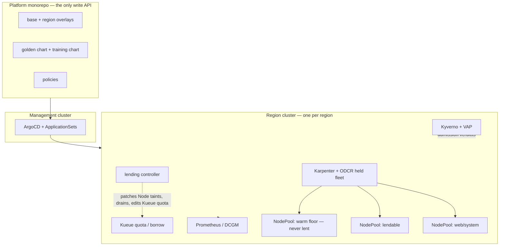

# Architecture

This is the map an infrastructure engineer needs before touching the system:
what the pieces are, how they fit, and where control and data flow. It explains
the shape; it does not deploy it (that is [deploy the
platform](../runbooks/deploy-platform.md)) or operate it (that is
[operations](../runbooks/operations.md)). For *why* the platform lends GPUs at
all, read [why-lending](why-lending.md) first — this doc assumes it.

## The shape in one paragraph

One management cluster (the **hub**) reconciles many region clusters (the
**spokes**) from a single git repo. Git is the only write API; ArgoCD is the
only actuator. Each spoke runs the serving-and-training substrate: Karpenter for
GPU capacity, Kueue for quota and borrowing, a lending controller for the
lend/reclaim lifecycle, Kyverno + ValidatingAdmissionPolicy for the policy
plane, and Prometheus for the evidence plane. Nothing is applied to a cluster by
hand.

## The four planes

The system is easier to reason about as four planes than as a pile of
components. Each answers one question.

- **Contract plane — "what is the desired state?"** The git monorepo. Base
  manifests plus per-region overlays; one golden Helm chart whose
  values(+schema) are the entire deploy interface for ~100 services; a separate
  training-job chart. Humans and agents author here and nowhere else.
- **Actuation plane — "who makes it real?"** Reconcilers only. ArgoCD (hub) syncs
  git to spokes; Karpenter (per spoke) provisions and recycles nodes. No
  imperative prod access; every change is attributable to the commit that caused
  it.
- **Policy plane — "what is allowed?"** Kyverno ClusterPolicies plus in-API-server
  ValidatingAdmissionPolicy (CEL). Verdicts replace approval queues and enforce
  the tenancy boundaries the lending model depends on.
- **Evidence plane — "what is actually happening?"** Prometheus + DCGM as a
  read-API: render-start latency, GPU allocation-vs-kernel utilization, per-team
  GPU-hour attribution, lending/preemption events, capacity scarcity. Machine
  readable so agents read targets, not dashboards.

## Component map

| Component | Plane | Role | Lives in |
|---|---|---|---|
| Golden Helm chart | contract | The deploy interface for all serving workloads (values = API) | `charts/golden-service/` |
| Training-job chart | contract | Preemptible training contract (checkpoint, grace, lendable-only) | `charts/training-job/` |
| ArgoCD hub + ApplicationSets | actuation | Renders overlays/services to spokes; one App per component and per service | `clusters/mgmt/` |
| Karpenter + EC2NodeClass/NodePools | actuation | GPU capacity from ODCR-held fleet; warm-floor / lendable / web pools | `clusters/*/karpenter/`, `infra/terraform/regions/*` |
| Kueue | scheduling | Team quota + git-scheduled borrowing-limit curve for training | `clusters/*/kueue/` |
| Lending controller | actuation | Lend/reclaim lifecycle: Node taint flips, drains, Kueue quota edits, scrub | `clusters/*/lending/` |
| Kyverno + VAP | policy | Tenancy guard, team-label, secret scoping, NetworkPolicy generation | `policies/` |
| Prometheus + DCGM | evidence | SLOs, attribution, scarcity, preemption events | `clusters/*/observability/` |
| ODCR capture | capacity | Hold running instances in reservations before any ECS→EKS carve | `infra/terraform/regions/*/odcr/` |

## Control flow — a change from PR to running

1. An engineer or agent opens a PR against the monorepo — a golden-chart values
   file, an overlay, a policy.
2. `make validate` (the same script locally and in CI) renders the charts,
   schema-checks manifests, runs the Kyverno test suite, and — the load-bearing
   step — applies the real policies to the *rendered* output so a chart that
   would emit a rejected pod fails here, not at admission.
3. The change lands in the right lane by capability tier: autonomous
   (ns-scoped, non-prod, or a policy-passing values-only prod change post
   game-day) can auto-merge; prod topology / quota / NodePool changes need a
   human review; cross-tenant or secret-material changes are denied outright.
4. On merge, the hub's ApplicationSets converge the change to the target spoke.
5. The evidence plane records the result; an agent can read the SLO to confirm.

## Data-plane flow — the lend/reclaim cycle

The serving path and the lending lifecycle are the two flows that matter at
runtime. Serving never passes through Kueue — inference schedules directly and
holds its latency floor via a high PriorityClass. Lending is the controller's
job:

- **Night:** the lending window opens (git schedule); the controller flips
  lendable-pool Node taints so training tolerates them, and shrinks nothing yet.
  Kueue admits training up to the borrowing-limit curve.
- **Pre-ramp:** the controller shrinks the borrowing-limit curve (stops new
  training admission) and runs staged reclaim waves — drain training with the
  120 s grace, then recycle each node.
- **Scrub:** reclaim recycles a node by terminating the instance (fresh VRAM,
  not an in-place reimage) and booting a clean one, verified before it rejoins
  the prod-tolerable pool.
- **Emergency:** if inference demand outruns the curve, kube-scheduler
  PriorityClass preemption evicts training node-level immediately — the fast,
  lossy fallback beneath the planned path.

The reclaim mechanism — why serving never queues and demand enters Kueue as a
scheduled quota curve — has its own discussion in the reclaim model *(planned:
`reclaim-model.md`)*.

## Load-bearing decisions

The decisions that constrain everything downstream, in one line each (full
rationale in the plan, `docs/plans/`):

- Git is the sole write API; reconcilers the sole actuators — audit, rollback,
  and agent safety cage in one mechanism.
- Golden-chart values(+schema) are the permanent interface; the env-spec bridge
  is a migration bridge with a retirement date.
- Node-level lending with terminate-and-recover scrub before any finer GPU
  sharing — failure-domain and compliance safety first.
- The render path is optimized for latency, the training path for utilization —
  opposite objectives, deliberately.
- Capacity intent lives in git; scarcity is structured evidence, not an error.

## Boundaries and single points

- **The hub is a single control-plane dependency.** If it dies, spokes keep
  serving and lending (their controllers are region-local); only reconciliation
  pauses. It is also a single high-value compromise target — hence per-spoke
  scoped, rotated credentials and alerting on anomalous hub-originated syncs.
- **Trust is reset, not shared.** A node serves one trust domain at a time;
  customer-data and R&D never co-tenant a node, enforced by taints + policy, and
  the between-tenant reset is instance termination.
- **Everything offline-provable stops at the cluster edge.** Chart rendering,
  schema, and policy composition are checkable on a laptop; lending, preemption,
  and sync require a real cluster (see the [deploy
  guide](../runbooks/deploy-platform.md)).
