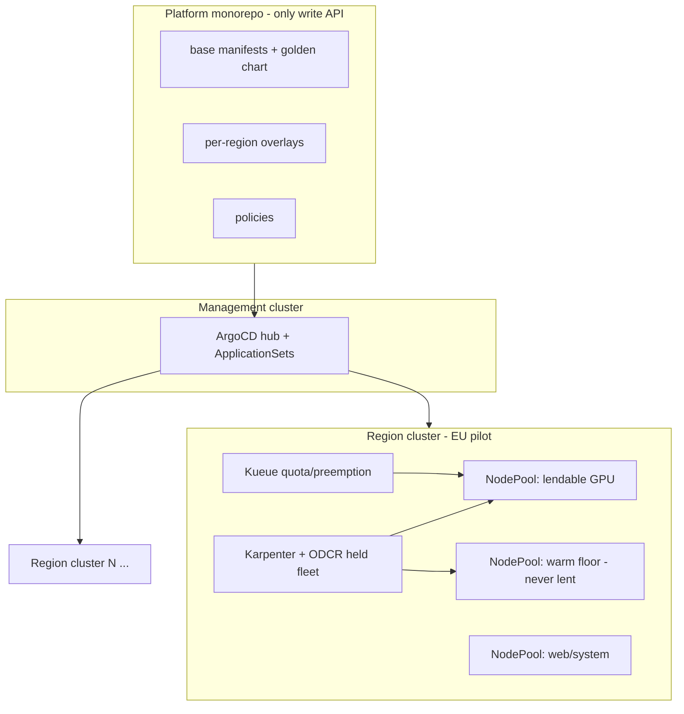
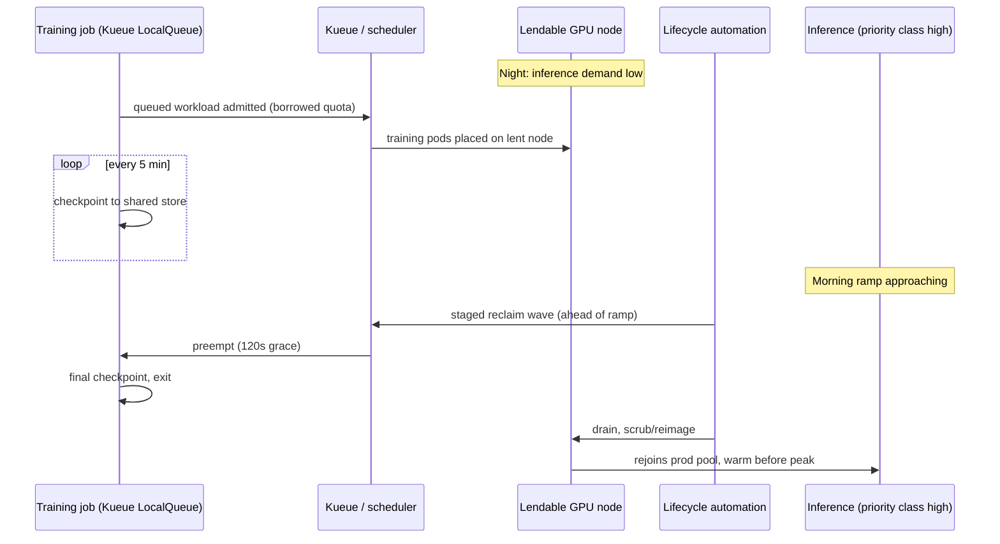
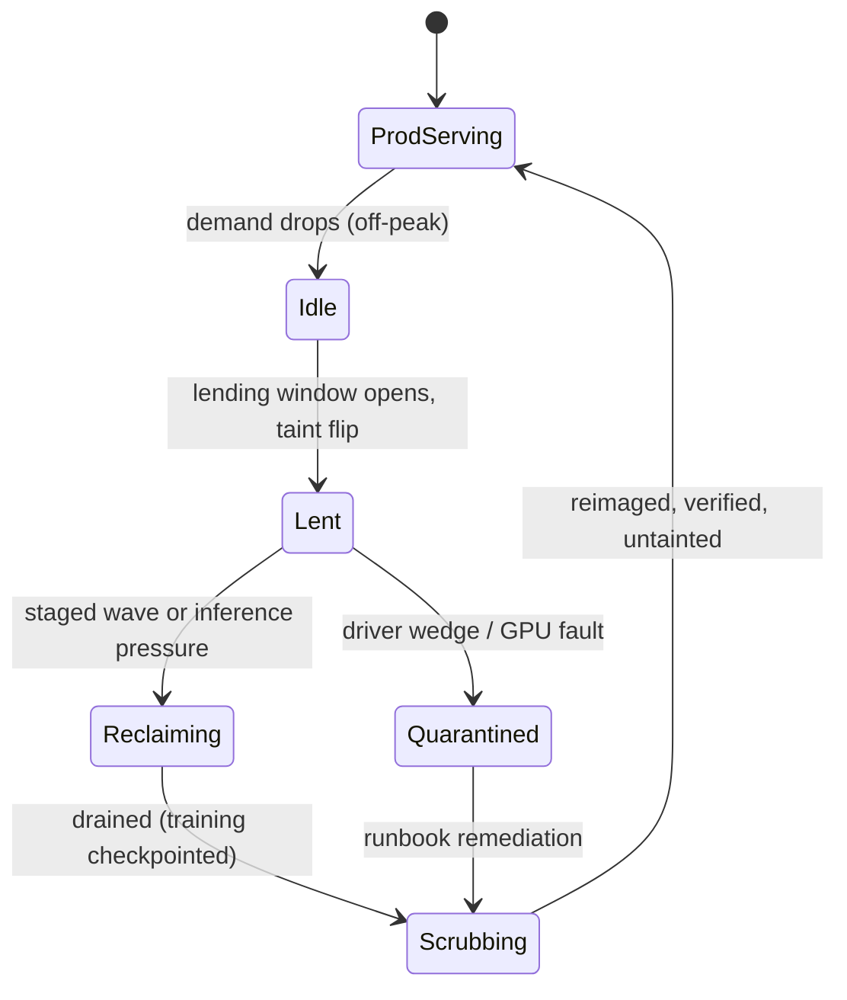
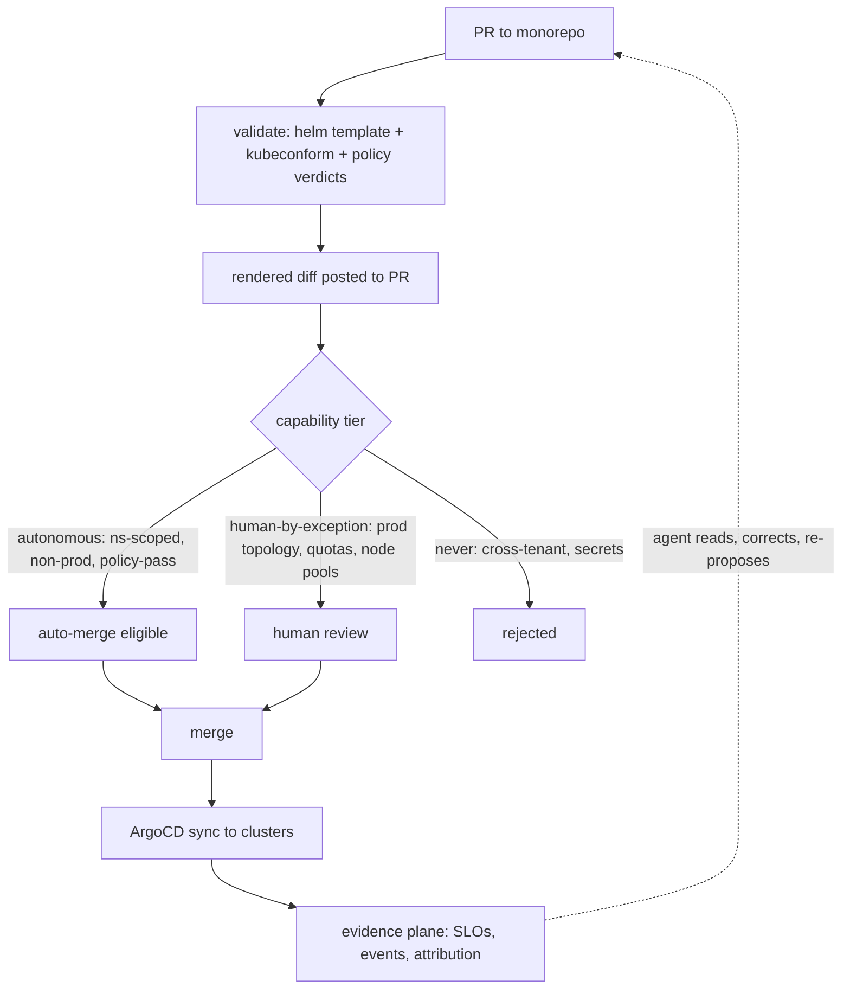

# Multi-Region GPU Compute Platform on EKS - Plan

**Target repo:** this repository (synorg) becomes the platform GitOps monorepo — confirmed in planning session.

## Goal Capsule

- **Objective:** End GPU double-pay by building one EKS substrate per region where prod inference holds its render-start latency floor while idle held GPUs are lent to preemptible R&D training — git as the only write API, a golden Helm chart as the deploy interface, policy verdicts replacing approval queues, and LLM agents as first-class consumers.
- **Authority hierarchy:** `eks-platform.prd` (product intent) > this plan > repo conventions established as units land.
- **Stop conditions:** Render-start p95 breach during the U10 game-day that warm-floor resizing cannot fix; compliance rejection of scrub-on-return node reuse (Assumption 6); GPU capacity release forced by any step (held capacity may not return — never descale as a side effect).
- **Execution profile:** Infrastructure-heavy; verification is rehearsal-style (policy test suites, rendered-diff golden tests, preemption game-days) until real clusters exist. Units U1–U5 are executable against a fresh AWS account; U6+ require the pilot cluster.
- **Tail ownership:** Fleet-shaping loop, quarterly premium review, and ECS retirement dates are operational follow-through owned by the platform team after U14.

---

## Product Contract

### Summary

Phased build: contract/actuation planes first (repo, ArgoCD hub-spoke, golden chart, policy tiers), GPU lending second (Kueue quota curve, checkpoint contract, node lend/reclaim lifecycle), then one real pilot inference service at ECS-baseline parity before multi-region rollout, remaining migration and ECS retirement last. The PRD's six open questions are carried as documented assumptions with revisit triggers.

### Problem Frame

Scarce GPU capacity is rented and deliberately never descaled, because released capacity may not return. The prod inference fleet sits ~90% idle at night while R&D trains at 100% on separately-bought capacity — the company pays an availability premium on the held fleet plus full price for training. Today's platform boundary (ECS static ASGs, no scheduler-level preemption) makes lending unsafe, and deploys pass through a bespoke env-spec translated by humans across two orchestration platforms. Carried from `eks-platform.prd`.

### Requirements

**GPU lending and latency**

- R1. Shared GPU node pools where prod inference preempts R&D training via priority/quota; training is checkpoint-tolerant; reclaim honors an eviction SLA. (PRD FR1)
- R2. Render-start p95 ≤ per-region target including during morning reclaim; a never-lent warm floor exists per region. (PRD FR2)

**Substrate and migration**

- R3. All workloads land on EKS and ECS is retired — GPU pools migrate first, web fleet second. (PRD FR3)

**Contract and actuation planes**

- R4. Git is the only write API (base + per-region overlays); one golden Helm chart with values+schema as the interface; env-spec survives only as a migration bridge with a dated retirement. (PRD FR4)
- R5. Reconcilers are the only actuators (ArgoCD apps, Karpenter capacity); no imperative prod access; humans and agents are distinct, attributable principals. (PRD FR5)

**Evidence and policy**

- R6. Telemetry is a read-API (PromQL/logs/events) with machine-readable SLOs; lending state, preemption events, and per-team GPU-hour attribution are queryable. (PRD FR6)
- R7. Kyverno/OPA-class policy verdicts replace human approval queues, with capability tiers by blast radius: autonomous (ns-scoped, policy-passing, non-prod) / human-by-exception (prod topology, quotas, node pools) / never (cross-tenant, secret material). (PRD FR7)
- R8. Cluster-per-region; region set chosen by GPU availability ∧ training-data gravity ∧ EU customer-data residency; scarcity is surfaced as structured evidence ("asked 8×G7e, got 3") feeding a fleet-shaping loop. (PRD FR8)

**Non-functional**

- R9. Node-level lending isolation with scrub/reimage-on-return; customer-data workloads never share a node with R&D concurrently; MIG/time-slicing only with evidence; SOC2/ISO auditable. (PRD NFR1)
- R10. Validation (helm template + dry-run + policy) is identical locally and in CI, runs in seconds, produces a rendered diff in every PR, and yields deterministic, actionable admission errors. (PRD NFR2)
- R11. Zero bespoke DSLs in the end state; schemas are the docs; runbooks are executable playbooks in-repo. (PRD NFR3)
- R12. A preemption storm at morning ramp must not breach R2; training failure modes (driver wedge, memory fragmentation) stay contained to lent nodes. (PRD NFR4)
- R13. Centralized secret management is preserved; approvals become policy verdicts with humans reviewing exceptions. (PRD NFR5)

### Success Criteria

Carried from PRD success metrics: (1) render-start p95 per region incl. reclaim window shows no regression vs the ECS baseline; (2) allocation-idle on held GPUs off-peak approaches zero, kernel utilization reported separately per workload class; (3) share of R&D backlog served from reclaimed hours and $/GPU-hour double-pay reduction trend down; (4) held-capacity size justified by measured morning-peak demand plus scarcity evidence, reviewed quarterly; (5) zero human-translation deploy steps, PR-to-converged time tracked, share of changes auto-approved by policy; (6) 100% of GPU-hours attributed to a team/workload from day one.

### Scope Boundaries

- **Out (PRD non-goals):** SQS/queue replacement; active-active multi-region for scarcity alone (readiness only); abstracting Kubernetes away from consumers; self-hosting data stores (Atlas/RDS stay).
- **Out (plan):** finer-than-node GPU sharing (MIG/time-slicing) — deferred until node-level lending economics are measured (KTD3); building a permanent rehearsal region (Assumption 4 covers scheduling rehearsal with a harness instead).

#### Deferred to Follow-Up Work

- MIG partitioning for inference bin-packing, only with utilization evidence from R6 data.
- DRA adoption (device-level maintenance mode could later refine scrub-on-return to sub-node granularity) — revisit once the NVIDIA DRA driver hardens under kubernetes-sigs governance.
- Fleet-shaping automation beyond the documented loop (U9 emits the evidence; automated resizing proposals are follow-up).
- Demand-predictive warm floor sizing (replace the static floor with a forecast-driven one once R6 demand history exists — TRIZ dynamization direction).

---

## Planning Contract

### Key Technical Decisions

Carried from PRD (D1–D5), unchanged:

- KTD1. Git as sole write API; reconcilers as sole actuators — audit, rollback, and agent safety cage in one mechanism. (D1)
- KTD2. Golden chart values(+schema) as the permanent interface; env-spec is a bridge with a retirement date. (D2)
- KTD3. Node-level lending with scrub-on-return before any finer GPU sharing — failure-domain and compliance safety first. (D3)
- KTD4. Render path optimized for latency, training path for utilization — headroom is a feature on one, waste on the other. (D4)
- KTD5. Capacity intent lives in git; scarcity is evidence, not an error. (D5)

New, made in this plan (research-grounded):

- KTD6. **Kueue as the quota/borrow/preemption layer** on top of the default scheduler — the converged 2026 standard for "inference preempts training" with team quota and cohort borrowing (`reclaimWithinCohort`), lower blast radius than replacing the scheduler (Volcano/YuniKorn). Topology-Aware Scheduling (beta, default-on since v0.14, with node hot-swap) handles lent-node disappearance. Known issue to track: cohort borrowing-order bug kubernetes-sigs/kueue#7016. **Training-only admission:** serving workloads never pass Kueue; inference demand enters Kueue as a git-scheduled `borrowingLimit` curve on the training ClusterQueue (planned reclaim), with kube-scheduler PriorityClass preemption as the emergency layer when demand outruns the curve — the render path carries zero queueing.
- KTD7. **Hub-and-spoke ArgoCD** — one ArgoCD in a dedicated management cluster drives all region clusters (AWS-endorsed EKS Blueprints pattern); ApplicationSet Matrix generator (Git × Cluster) produces per-region Applications from base + overlay paths. Trade-off accepted: management cluster is a single control-plane dependency; region data planes keep serving if it dies (reconcile pauses, workloads run). The hub is also a compromise target with fleet-wide write reach: per-spoke scoped and rotated credentials, restricted human/agent access to the management cluster itself, and alerting on anomalous hub-originated syncs. Time-critical lend/reclaim actuations (reclaim schedules, taint flips, quota-curve enforcement) run region-local and survive a hub outage.
- KTD8. **Kyverno + ValidatingAdmissionPolicy (CEL) hybrid** resolves the PRD's "Kyverno/OPA" either-or: built-in VAP/CEL for simple stateless field rules (no webhook latency), Kyverno (CNCF-graduated, adoption leader) for cross-resource lookups, image verification, and generation. Not OPA/Gatekeeper — no existing Rego investment.
- KTD9. **Karpenter with ODCR-backed held fleet** — `capacityReservationSelectorTerms` on `EC2NodeClass` models the held GPU capacity natively (v1.10 line); consolidation treats reserved capacity as pre-paid and prefers it. Never-lent warm floor is a separate NodePool held explicitly — static-capacity NodePool support if GA in the pinned Karpenter version, otherwise a floor-sized low-PriorityClass balloon Deployment that inference pods evict instantly; without a hold mechanism, consolidation deletes exactly the empty headroom the floor exists to keep. Karpenter GPU node auto-repair is alpha and currently unreliable (kubernetes-sigs/karpenter#2833) — node health remediation is an executable runbook, not an assumed feature.
- KTD10. **Single platform GitOps monorepo (this repo)** — clusters, overlays, golden chart, policies, and runbooks in one repo; per-identity attribution comes from commit identity + ArgoCD app project, not repo boundaries.
- KTD11. **Strangler migration behind a shared ALB** for ECS→EKS — platform layer first, one non-critical workload proves the path, then waves; converged lesson from published migrations (lift-and-shift cutovers fail; ~6-month team ramp is a real cost).
- KTD12. **Training preemption contract: checkpoint every 5 minutes, 120 s preemption grace, ≤5 min lost-work budget** — matches published practice for preemptible training (NVIDIA Run:ai guidance, spot-notice conventions). Morning reclaim runs in staged waves ahead of the ramp so the warm floor plus staggered reclaim protect R2. The eviction SLA is two budgets: training-eviction grace (120 s) and a node return-to-service budget — a measured p95 reimage-to-prod-ready target pinned during U8 that drives wave lead time, lending-window length, and storm-window warm-floor sizing.

### Assumptions

The PRD's six open questions, converted to defaults with revisit triggers (agreed in session):

1. **R&D trains in/near the regions holding idle inference capacity** — at least one EU pilot region is co-located with training data. *Revisit:* U3's data-gravity check shows a gap → lending scope shrinks to co-located regions and the region set (R8) is re-derived.
2. **"90% idle" means allocation-idle**, so whole-node lending is the right fix. *Revisit:* U9 telemetry shows kernel-idle-under-allocation during peak → separate utilization workstream (batching, right-sizing), not more lending.
3. **Training backlog is deep enough to soak reclaimed night hours in the pilot region.** *Revisit:* after 4 weeks of lending, reclaimed-hour utilization is low → shrink the held fleet at quarterly review instead (Success Criterion 4), don't chase lending breadth.
4. **Rendered diff suffices for config changes; scheduling-behavior changes need synthetic rehearsal** — a game-day harness (U10) in the pilot region, not a permanent rehearsal region. *Revisit:* a scheduling regression escapes the harness → reconsider a dedicated rehearsal environment.
5. **Eviction SLA: 5-minute checkpoint cadence, 120 s grace, staged reclaim waves; node return-to-service budget measured and pinned at U8** (KTD12). *Revisit:* game-day breaches R2 → raise the warm floor first; tightening grace below 120 s is the last resort (it just destroys training work).
6. **Scrub/reimage-on-return satisfies the auditor for node reuse** between customer-data and R&D workloads. *Revisit:* compliance verdict rejects it → customer-data workloads get dedicated never-lent pools and lending is confined to non-customer-data pools. This is a stop condition, not a silent fallback.

### Contradiction Analysis (TRIZ)

The platform's core physical contradiction: the same node must be busy (training soaks paid-idle) and instantly free (inference latency floor), and must be trusted (customer data) and untrusted (arbitrary R&D code). The design resolves it by separation in time (lending windows, staged reclaim), separation in space (never-lent warm floor vs lendable pool), and discard-and-recover (scrub/reimage between trust domains). Matrix analysis (improving utilization/time-loss/productivity vs worsening speed/reliability/security) confirms the design's principles and surfaced three directions the plan adopts or defers:

- **Scrub off the critical path** (adopted, U8): rotate scrub through the night so reclaim waves take pre-scrubbed nodes first — morning ramp never waits on a reimage.
- **Attestation-accelerated trust reset** (investigate in U8): hardware attestation (Nitro/TPM measured boot) may re-establish node trust faster than full reimage; adopt only with compliance sign-off (Assumption 6).
- **Demand-predictive warm floor** (deferred): replace the static floor with a forecast-sized one once the evidence plane has enough demand history.
- **Aggregate-demand intermediary** (adopted, KTD6/U6): inference demand enters Kueue as a scheduled borrowing-limit curve, never as per-pod admission — resolves "Kueue must see demand ∧ serving must never queue" (separation parts/whole + intermediary).

### High-Level Technical Design

**System topology** — hub-spoke control plane, cluster-per-region data plane:

**GPU lend/reclaim cycle** — the core loop the platform must get right:

**Node lifecycle** — states the lifecycle automation (U8) owns:

**Deploy contract flow** — every change, human or agent:

### Risks & Dependencies

| Risk | Impact | Mitigation |
|---|---|---|
| Preemption storm at morning ramp breaches p95 | Customer-facing latency (R2, R12) | Warm floor never lent; staged waves + night scrub rotation keep reimage off the critical path; U10 game-day gates every region before lending enables |
| Compliance rejects scrub-on-return node reuse | Lending model shrinks (Assumption 6) | Stop condition, not fallback-by-default: dedicated never-lent customer-data pools ready as the designed alternative; seek verdict early, before U8 lands |
| Kueue cohort borrowing-order bug (kubernetes-sigs/kueue#7016) | Wrong workload preempted under contention | Pin Kueue version only after U10 scenarios verify reclaim order; track upstream fix |
| Karpenter GPU node auto-repair alpha bug (kubernetes-sigs/karpenter#2833) | Wedged GPU nodes stay broken silently | Health remediation is an executable runbook with quarantine taint (U8), not the alpha feature; DCGM alerts feed U9 |
| Management cluster outage (hub-spoke) | Reconciliation pauses fleet-wide | Region data planes keep serving (KTD7 trade-off); mgmt cluster rebuild is itself GitOps-reproducible; break-glass runbook |
| Accidental capacity release during node replacement | Held GPUs may not return (PRD premise) | ODCR binding means replaced nodes re-launch into the same reservation; U15 captures running ECS instances into open ODCRs before any termination; U3 verification asserts zero release on apply |
| Management cluster compromise | Fleet-wide write reach incl. EU customer-data clusters | Per-spoke scoped/rotated credentials; restricted mgmt-cluster access; anomalous-sync alerting; region-local time-critical actuations (KTD7) |
| Team EKS ramp (~6 months to competence) | Sequencing slips, migration stalls | Strangler waves sized to team capacity (KTD11); playbook reuse (U13→U14) concentrates learning |
| Training backlog too thin to soak lent hours | Utilization win doesn't materialize (Assumption 3) | Quarterly held-fleet resize using U9 evidence — shrink the premium instead of forcing lending |

Upstream dependencies: ODCR coverage for the held fleet's instance families in each target region; the incumbent central secret manager's External Secrets Operator compatibility; shared ALB ownership for strangler weighting (U13/U14).

### Open Questions

All deferred (non-blocking) — none holds readiness back:

1. Does the incumbent central secret manager have a maintained External Secrets Operator provider? Verify before U5 builds on it.
2. Are per-region render-start p95 targets formally the ECS baselines, or separately negotiated numbers? Record the concrete figure before the first U10 game-day.
3. Who owns shared-ALB weighting during strangler waves — the monorepo (git-only write path, KTD1) or incumbent ECS tooling? Decide before the U13 pilot wave.
4. Who staffs the human-by-exception review lane at 100-team scale, and is its review latency part of Criterion 5's PR-to-converged tracking?
5. Does the evidence-plane read-API need cross-team access scoping (per-team GPU-hour data leaks business signal between teams)?

### Sequencing

Four phases; units within a phase can parallelize where dependencies allow. Phase 1 (U1–U5, with U15's reservation capture ahead of U3) builds the cage before anything lives in it. Phase 2 (U6–U10) is the lending core and must pass the game-day gate. Phase 3 (U11, U13 pilot wave, then U12) proves the loop against one real inference service at ECS-baseline parity before multi-region rollout replicates it. Phase 4 (U13 remaining waves, U14) completes migration — U15's capacity carve rides those waves — and retires ECS.

---

## Implementation Units

| U-ID | Title | Key files | Depends on |
|---|---|---|---|
| U1 | Monorepo scaffold + validation loop | `Makefile`, `scripts/validate.sh`, `.github/workflows/` | — |
| U2 | Management cluster + ArgoCD hub | `infra/terraform/mgmt/`, `clusters/mgmt/` | U1 |
| U3 | Pilot region cluster + Karpenter held fleet | `infra/terraform/regions/`, `clusters/pilot/` | U2, U15 |
| U4 | Golden Helm chart + values schema | `charts/golden-service/` | U1 |
| U5 | Policy plane + capability tiers + identity | `policies/` | U1, U3 |
| U6 | Kueue scheduling layer | `clusters/pilot/kueue/` | U3, U5 |
| U7 | Training workload contract | `charts/training-job/`, `infra/terraform/regions/pilot/checkpoint-store/` | U6 |
| U8 | Node lend/reclaim lifecycle | `clusters/pilot/lending/`, `runbooks/` | U6, U7 |
| U9 | Evidence plane + attribution | `clusters/pilot/observability/` | U3, U5, U6, U8 |
| U10 | Preemption game-day harness | `rehearsal/` | U8, U9 |
| U11 | Agent consumer loop end-to-end | `docs/agent-interface.md`, `runbooks/` | U4, U5, U9 |
| U12 | Multi-region rollout | `clusters/<region>/`, `infra/terraform/regions/` | U10, U13 (pilot wave) |
| U13 | Inference migration + env-spec bridge | `charts/golden-service/`, `tools/env-spec-bridge/` | U4, U5, U9, U15 |
| U14 | Web fleet migration + ECS retirement | `clusters/*/web/` | U13 |
| U15 | Held-capacity capture and carve | `infra/terraform/regions/pilot/odcr/`, `docs/capacity-transition.md` | — |

### U1. Monorepo scaffold and validation loop

- **Goal:** This repo becomes the platform monorepo with a validation loop identical locally and in CI, in seconds.
- **Requirements:** R4, R10, R11
- **Dependencies:** none
- **Files:** `Makefile`, `scripts/validate.sh`, `.github/workflows/validate.yaml`, top-level layout (`clusters/`, `charts/`, `policies/`, `infra/`, `runbooks/`, `rehearsal/`, `tools/`), `README.md`
- **Approach:** `git init` here; single `make validate` entrypoint running helm template → kubeconform (schema) → policy verdicts (Kyverno CLI + VAP dry-run) → rendered diff; CI calls the same script byte-for-byte. `make validate` scopes helm rendering and policy tests to charts/overlays touched by the diff; a nightly CI job runs the full-repo render, so the seconds budget holds at ~100-service scale. Runbooks directory established as executable playbooks from day one (R11).
- **Execution note:** This is scaffolding/config; prefer smoke verification (run `make validate` against a sample chart) over unit coverage.
- **Test scenarios:** valid sample manifest passes in <10 s locally; schema-violating values produce a deterministic, actionable error naming the field; CI and local runs produce identical output on the same input; rendered diff appears on a test PR; full-repo render timed at synthetic target scale (~100 services × region overlays) in the nightly job.
- **Verification:** `make validate` green locally and in CI on the same commit; deliberately broken input fails with the documented error shape.

### U2. Management cluster and ArgoCD hub

- **Goal:** Hub-spoke ArgoCD in a dedicated management cluster, wired to the monorepo as its only source.
- **Requirements:** R5
- **Dependencies:** U1
- **Files:** `infra/terraform/mgmt/`, `clusters/mgmt/argocd/`, `clusters/mgmt/appsets/`
- **Approach:** EKS Blueprints hub-spoke pattern; ApplicationSet Matrix generator (Git generator over `clusters/<region>/` paths × Cluster generator over registered clusters); ArgoCD projects partition blast radius per team; no `kubectl` write access to any cluster outside break-glass (documented in a runbook).
- **Patterns to follow:** AWS EKS Blueprints "ArgoCD Multi-Cluster Hub & Spoke" Terraform pattern.
- **Test scenarios:** ApplicationSet renders exactly one Application per (registered cluster × overlay path); removing a cluster from registration prunes its Applications without touching others; direct `kubectl apply` by a non-break-glass identity is denied.
- **Verification:** hub reconciles a hello-world app to a spoke; audit log attributes the sync to the originating commit.

### U3. Pilot region cluster and Karpenter held GPU fleet

- **Goal:** One EU pilot region cluster with the held GPU capacity modeled in git: warm-floor pool (never lent), lendable GPU pool, web/system pool.
- **Requirements:** R2 (warm floor), R8 (first region), R9 (pool separation)
- **Dependencies:** U2, U15 (reservation capture precedes binding)
- **Files:** `infra/terraform/regions/pilot/`, `clusters/pilot/karpenter/` (EC2NodeClass + NodePools)
- **Approach:** Karpenter with `capacityReservationSelectorTerms` binding NodePools to the ODCRs created by U15's capture (KTD9); warm-floor NodePool is held per KTD9 (static-capacity support or balloon Deployment) with a taint scheme only inference tolerates; lendable pool taints flip under U8's control. Region choice validates Assumption 1 (training-data gravity) before Terraform is applied — a one-page data-locality check recorded in `docs/`.
- **Test scenarios:** Karpenter provisions from the ODCR before falling back to on-demand; consolidation never removes warm-floor nodes below the floor (asserted against the chosen hold mechanism); a pod without the inference toleration never lands on the warm floor; scarcity evidence appears as structured events when a flavor is unavailable ("asked N, got M").
- **Verification:** pools visible and correctly tainted in the pilot cluster; ODCR utilization reflected in Karpenter metrics; no capacity released during any apply (stop condition).

### U4. Golden Helm chart and values schema

- **Goal:** One chart serving ~100 services; `values.yaml` + `values.schema.json` is the whole deploy interface.
- **Requirements:** R4, R10, R11
- **Dependencies:** U1
- **Files:** `charts/golden-service/` (templates, `values.schema.json`, `README.md` generated from schema), `charts/golden-service/ci/` (test values)
- **Approach:** Chart covers deploy/service/HPA/PDB/priority-class/service-account surface; schema is strict (`additionalProperties: false`) so unknown keys fail at validate time with a named-field error (R10); base + per-region overlay values layering matches the ApplicationSet paths from U2. Schema is the documentation (R11) — no separate deploy wiki.
- **Test scenarios:** minimal values render a complete, policy-passing workload; each schema constraint violation yields an error naming field and expectation; region overlay overrides base without duplicating it; GPU-consuming values set the right priority class and node affinity for the warm floor vs lendable pools.
- **Verification:** two representative services (one web, one GPU inference) render from the same chart with only values differing; `make validate` covers chart CI values in the standard loop.

### U5. Policy plane, capability tiers, and identity

- **Goal:** Policy verdicts replace approval queues; humans and agents are distinct, attributable principals with tiered autonomy.
- **Requirements:** R7, R5, R13, R9 (tenancy guard)
- **Dependencies:** U1, U3
- **Files:** `policies/vap/` (CEL, stateless field rules), `policies/kyverno/` (cross-resource, generation, image verification), `policies/tests/`, `docs/capability-tiers.md`
- **Approach:** KTD8 hybrid. Tier encoding: autonomous = ns-scoped + non-prod + all policies pass → eligible for auto-merge, and policy-passing values-only changes to existing prod services join this lane once that region's game-day gate has passed (routine deploys must not recreate the approval queue R7 kills); human-by-exception = prod topology, quota, NodePool changes → blocked by a technical merge gate (branch protection requiring an approving review), not a label convention; never = cross-tenant references, secret material in manifests → hard admission deny. SecretStore bindings are namespace-scoped (backend IAM limits which secret paths a team can reference). Lendable-pool workloads run under NetworkPolicy egress restriction — no route to customer-data services or the secrets endpoint; node isolation alone is not network isolation. Tenancy guard policy: customer-data-labeled workloads and R&D workloads may never be schedulable onto the same node concurrently (R9) — enforced via required node affinities/taints, not convention. Secrets stay in the incumbent central manager, consumed via External Secrets Operator; policy forbids inline secret material (R13).
- **Test scenarios:** each tier has a fixture change that lands in the right lane (auto / review / deny), including a values-only prod image bump landing autonomous post-game-day; a manifest referencing another tenant's namespace is denied with a deterministic message; an R&D pod tolerating a customer-data node's taint is denied; an R&D-namespace ExternalSecret referencing a prod secret path is denied; a training pod's egress to a customer-data service is denied by NetworkPolicy; a human-by-exception change cannot merge without an approving review (gate is technical, not label); policy test suite (`kyverno test` + VAP CEL tests) runs inside `make validate`.
- **Verification:** all policy tests green in CI; a rehearsed agent-authored ns-scoped non-prod change auto-passes; a NodePool edit is blocked pending review.

### U6. Kueue scheduling layer

- **Goal:** Quota, borrowing, and preemption semantics: inference always wins, training soaks the rest.
- **Requirements:** R1
- **Dependencies:** U3, U5
- **Files:** `clusters/pilot/kueue/` (ResourceFlavors, ClusterQueues, cohort, LocalQueues, PriorityClasses)
- **Approach:** KTD6, training-only admission — serving never passes Kueue. ResourceFlavors per GPU type/pool; training ClusterQueue borrows lendable capacity under a git-scheduled `borrowingLimit` curve, the aggregate representation of inference demand: the curve shrinks ahead of morning ramp and Kueue preempts training to fit (planned reclaim, checkpoint-friendly); LocalQueues per R&D team give per-team attribution at admission. Emergency layer: pending high-priority inference pods preempt training node-level via kube-scheduler PriorityClass when demand outruns the curve — no queue on the render path, and the golden chart needs zero queue wiring. Topology-Aware Scheduling on (default since v0.14) so lent-node loss triggers hot-swap rather than wedging workloads. Track kueue#7016 (borrowing order) — pin the Kueue version after verifying behavior in U10.
- **Test scenarios:** training admits only when the borrowing-limit curve has headroom; shrinking the curve preempts training within the checkpoint contract with no inference pod involved; a pending high-priority inference pod preempts training node-level (emergency layer) without Kueue involvement; per-team LocalQueue quota caps hold under contention; TAS reschedules a training workload after its node disappears mid-run.
- **Verification:** kueue metrics show borrow/reclaim transitions matching a scripted contention scenario in the pilot cluster.

### U7. Training workload contract

- **Goal:** A training job template that survives preemption by design: checkpoint-tolerant, resumable, lent-node-only.
- **Requirements:** R1, R12
- **Dependencies:** U6
- **Files:** `charts/training-job/` (job template chart, `values.schema.json`), `infra/terraform/regions/pilot/checkpoint-store/`, `runbooks/training-onboarding.md`
- **Approach:** KTD12 contract: torchrun-elastic template, checkpoint to shared store every ≤5 min, entrypoint resumes from latest checkpoint, `terminationGracePeriodSeconds: 120` with a preStop final checkpoint; tolerates only lendable-pool taint (never warm floor, R12 containment); R&D teams consume it via the same values+schema interface as services (R4 symmetry). U7 also provisions the shared checkpoint store, sized for the worst case — every lent node final-checkpointing concurrently inside the 120 s grace.
- **Test scenarios:** job killed with 120 s grace resumes losing ≤5 min of progress; job without the checkpoint contract fields fails schema validation; template pods cannot schedule onto warm-floor or web pools; driver-wedge simulation (device plugin failure) marks only the lent node, workload rescheduled elsewhere.
- **Verification:** a real (small) training run survives three scripted preemptions in the pilot cluster and completes.

### U8. Node lend/reclaim lifecycle

- **Goal:** The lend → reclaim → scrub → return loop from the HTD state machine, automated and auditable.
- **Requirements:** R1, R9
- **Dependencies:** U6, U7
- **Files:** `clusters/pilot/lending/` (lending-window config, reclaim CronWorkflows/controller config), `runbooks/node-scrub.md`, `runbooks/gpu-node-quarantine.md`
- **Approach:** Lending window opens off-peak: the lifecycle controller patches taints on Node objects from the git-controlled schedule — never by editing NodePool `spec.template` taints, which Karpenter drift-detects and answers with full-pool replacement at every window transition (KTD5: capacity intent in git; actuation region-local). The same schedule drives U6's borrowing-limit curve, so staged reclaim waves are quota shrink + drain (KTD12). Scrub = `nodeclaim` deletion, which terminates the EC2 instance — the returning node is a new instance booting a fresh AMI, so GPU device memory cannot survive the lend/reclaim boundary — verified before rejoining the prod-tolerable pool. The node return-to-service budget (KTD12) is measured and pinned here as the wave lead-time input. Scrub rotates through the night where backlog allows, so reclaim waves prefer pre-scrubbed nodes and the morning ramp never waits on a reimage (TRIZ: preliminary action); evaluate hardware attestation as a faster trust reset, gated on the Assumption 6 compliance verdict. GPU health remediation is an executable runbook, not alpha auto-repair (KTD9 caveat): DCGM failure → quarantine taint → runbook. Every state transition emits an event consumed by U9.
- **Test scenarios:** reclaim wave preempts training, drains, replaces the node, and the fresh node serves inference — end-to-end within the node return-to-service budget; the returned node carries a new EC2 instance ID (GPU device memory cannot persist across the cycle); a node is never prod-schedulable between lend and completed scrub (assert via taint audit); quarantined node never returns without runbook completion; lending schedule change lands only via PR (write path audit).
- **Verification:** full cycle demonstrated on the pilot cluster with timeline evidence (events + metrics) attached to the PR that enables the schedule.

### U9. Evidence plane and attribution

- **Goal:** Telemetry as read-API: machine-readable SLOs, lending/preemption events, 100% GPU-hour attribution, scarcity evidence.
- **Requirements:** R6, R8 (scarcity evidence)
- **Dependencies:** U3, U5 (label enforcement), U6 (preemption events), U8 (lifecycle events)
- **Files:** `clusters/pilot/observability/` (Prometheus/exporters, recording rules, SLO definitions as config), `docs/slo-catalog.md` (generated from the SLO config, not hand-written)
- **Approach:** Render-start p95 recording rules per region incl. a reclaim-window-scoped variant (Success Criterion 1); DCGM exporter separates kernel utilization from allocation (Assumption 2's revisit trigger lives here); GPU-hour attribution joins pod team labels (enforced by U5 policy — unlabeled GPU pods denied) with node lifecycle events; Karpenter scarcity events shaped into a queryable "asked/got" series feeding the fleet-shaping loop. The remaining success-criteria series live here too: $/GPU-hour from billing data joined to attribution and reclaimed-hours-served share from Kueue borrow metrics (Criterion 3), PR-to-converged time and auto-approval share from CI + ArgoCD sync events (Criterion 5).
- **Test scenarios:** every GPU-hour in a test window attributes to exactly one team (no unattributed remainder); preemption events queryable by team/job/node within seconds of occurrence; scarcity series records a deliberate over-ask against a constrained flavor; SLO definitions parse machine-readably (agents can read targets, not just dashboards); every success-criteria series (1–6) resolves from evidence-plane queries without hand-collection.
- **Verification:** attribution report over a lending cycle sums to node-hours provisioned; PromQL queries in `docs/slo-catalog.md` execute as documented.

### U10. Preemption game-day harness

- **Goal:** Rehearse the morning-ramp preemption storm synthetically; prove R2 holds before real traffic depends on it.
- **Requirements:** R2, R12
- **Dependencies:** U8, U9
- **Files:** `rehearsal/` (load generator config, storm scenarios, pass/fail assertions), `runbooks/game-day.md`
- **Approach:** Assumption 4's answer: synthetic inference load ramps against the pilot cluster while training saturates lent nodes; scripted scenarios — normal staged reclaim, compressed reclaim (late wave), storm (all lent nodes reclaimed at once), driver wedge during reclaim. Pass gate: render-start p95 within target throughout AND aggregate lost work per preempted training job ≤5 min with all lent nodes checkpointing concurrently (shared-store write throughput measured during the wave); fail routes to warm-floor resize first (Assumption 5). This is the Phase 2→3 gate.
- **Test scenarios:** the four scenarios above, each with recorded p95 timelines; repeat-run variance small enough that a regression is distinguishable from noise; harness runs from CI on demand against the pilot cluster.
- **Verification:** signed-off game-day report in-repo with metric evidence; R2 pass is a precondition for U12.

### U11. Agent consumer loop end-to-end

- **Goal:** An LLM agent completes the full loop — propose → validate → observe → correct — with no human translator (PRD user 4).
- **Requirements:** R5, R6, R7, R10, R11 (integration of all)
- **Dependencies:** U4, U5, U9
- **Files:** `docs/agent-interface.md` (the contract: repo layout, schema locations, validate entrypoint, SLO read-API, capability tiers), `runbooks/` (executable shape verified)
- **Approach:** Mostly verification-of-integration plus one artifact: a single doc that tells an agent (or new hire — D2 rationale) where the interface surfaces are. Acceptance-style unit: run a real agent through scenarios rather than building new infrastructure. Distinct agent principal (bot identity) exercises attribution (R5).
- **Test scenarios:** agent authors a valid ns-scoped non-prod change → auto-approved lane, converged, attributed to the agent principal; agent submits an invalid change → error message alone is sufficient for the agent to self-correct within one retry; agent answers "what's my service's render-start p95 during this morning's reclaim?" from the read-API alone; agent executes a runbook end-to-end.
- **Verification:** all four scenarios pass with transcript evidence; failures traced to interface gaps become fixes in U4/U5/U9, not agent-side workarounds.

### U12. Multi-region rollout

- **Goal:** Second and subsequent region clusters from overlays alone; region set derived from the R8 predicate.
- **Requirements:** R8, R2 (per-region floors)
- **Dependencies:** U10 (game-day gate passed), U13 pilot wave (one real inference service at ECS-baseline parity on the pilot cluster — the harness is calibrated against real render traffic before lending scales out)
- **Files:** `infra/terraform/regions/<region>/`, `clusters/<region>/` (overlay only — divergence beyond values is a defect), `docs/region-set.md` (the R8 derivation: GPU availability ∧ data gravity ∧ EU residency)
- **Approach:** Each new region is Terraform module instantiation + overlay directory + ApplicationSet pickup; EU residency constraints encoded as U5 policy (customer-data workloads restricted to compliant regions); per-region warm floor sized from that region's measured demand, not copied from pilot. Lending windows are region-local (Assumption 3's "whose night" concern — windows follow regional off-peak, revisited with global-customer data).
- **Test scenarios:** new region reaches converged state with zero manual cluster-side steps after PR merge; a customer-data workload targeting a non-compliant region is denied at validate time; per-region game-day (U10 harness pointed at the new region) passes before lending enables there.
- **Verification:** region 2 live with lending enabled behind its own game-day pass; diff between region overlays is values-only.

### U13. Inference service migration and env-spec bridge

- **Goal:** GPU inference services move from ECS to the golden chart; env-spec becomes a mechanical bridge with a retirement date.
- **Requirements:** R3 (first wave), R4 (bridge retirement)
- **Dependencies:** U4, U5, U9, U15 (capacity carve rides the migration waves)
- **Files:** `tools/env-spec-bridge/` (env-spec → values translator), `clusters/pilot/services/` (migrated service values), `docs/env-spec-retirement.md` (dated schedule)
- **Approach:** KTD11 strangler: shared ALB weights shift per service from ECS target group to EKS; bridge tool translates existing env-specs to golden-chart values mechanically (zero human translation — Success Criterion 5), each translation reviewed once then owned as values; retirement date set when the last consumer converts, published in-repo. Pilot service is non-critical inference, validated against the ECS baseline p95 before weight shift; the pilot wave gates U12. Each wave's freed ECS GPU instances recycle into EKS nodeclaims via U15's carve — never terminated before the reservation shows their capacity held.
- **Test scenarios:** bridge translation of each distinct env-spec construct produces schema-valid values (fixture per construct); translated pilot service serves shadow/weighted traffic at parity p95 vs its ECS baseline; rollback = ALB weight flip, rehearsed once; a service attempting to deploy via raw env-spec after its conversion date fails validate.
- **Verification:** pilot inference service at 100% on EKS with baseline-parity metrics for a full week including morning reclaims; migration playbook (`runbooks/service-migration.md`) proven twice.

### U14. Web fleet migration and ECS retirement

- **Goal:** Web fleet follows the proven path; ECS reaches zero workloads and is retired.
- **Requirements:** R3 (completion)
- **Dependencies:** U13
- **Files:** `clusters/*/web/` (service values), `runbooks/service-migration.md` (reused), `docs/ecs-retirement.md`
- **Approach:** Same strangler mechanics, no GPU complexity; batch services in waves by risk (stateless first); each wave uses the U13 playbook unchanged — divergence means the playbook was wrong, fix it there. ECS retirement is the final PR removing bridge tooling (env-spec dies with it, R4/R11 end state: zero bespoke DSLs).
- **Test scenarios:** per wave — parity checks (p95, error rate) vs ECS baseline for each service before weight shift; a full-wave rollback rehearsal on the first wave; post-retirement validate rejects any env-spec artifact.
- **Verification:** ECS clusters empty and deleted; `tools/env-spec-bridge/` removed; deploy path metrics (Success Criterion 5) reported over the final month.

### U15. Held-capacity capture and carve

- **Goal:** Move held GPU capacity from ECS ASGs to the EKS fleet with zero net release at every step — the program's riskiest operation.
- **Requirements:** R3, R8; guards the Goal Capsule's never-release stop condition.
- **Dependencies:** none (account-level; the reservation capture precedes U3's binding, the carve rides U13's waves).
- **Files:** `infra/terraform/regions/pilot/odcr/`, `docs/capacity-transition.md` (capacity ledger), `runbooks/capacity-carve.md`
- **Approach:** Create open ODCRs matching the attributes of the running ECS GPU instances so they associate in place without relaunch; verify reservation utilization equals the running instance count before anything else proceeds (U3 binds NodePools to these reservations). Thereafter carve ECS→EKS in increments tied to U13 migration waves: recycle one instance at a time into an EKS nodeclaim, never terminating an instance before the reservation demonstrably holds its capacity. ODCR creation quotas and AWS lead times for scarce families surface early as scarcity evidence (KTD5).
- **Execution note:** Verify-before-terminate at every single step; any failed hold aborts the step, never the capacity.
- **Test scenarios:** open-ODCR association covers 100% of running held instances with zero relaunch; reservation utilization asserted equal to instance count before and after each carve step; a simulated carve step whose reservation fails to show capacity held aborts without terminating; net held-capacity count constant across a full migration wave.
- **Verification:** capacity ledger in `docs/capacity-transition.md` shows zero net release across the transition; first carve increment landed with reservation-utilization evidence attached to its PR.

---

## Verification Contract

| Gate | Command / mechanism | Applies to |
|---|---|---|
| Validation loop | `make validate` (helm template → kubeconform → kyverno test + VAP dry-run → rendered diff) | every PR, all units |
| Policy tests | `policies/tests/` fixtures inside `make validate` | U5 onward |
| Chart CI values | golden chart + training chart render checks | U4, U7 |
| Pilot-cluster scenario scripts | scripted contention / preemption / lifecycle runs with metric assertions | U6–U9 |
| Game-day gate | `rehearsal/` harness — render-start p95 within target across all four storm scenarios | U10; precondition for U12, re-run per region |
| Migration parity | per-service p95 + error-rate parity vs ECS baseline before ALB weight shift | U13, U14 |
| Attribution audit | GPU-hour attribution sums to provisioned node-hours, zero unattributed | U9 onward, continuous |
| Success-criteria series | all six criteria resolve from evidence-plane queries, no hand-collection | U9 onward |
| Capacity ledger | zero-net-release assertion per carve step (reservation utilization check) | U15, U13/U14 waves |

Quality bar for the loop itself: `make validate` completes in seconds (R10); any gate failure stops the line — no unit is complete with a red gate (Andon).

---

## Definition of Done

Global:

- All six success criteria green and measurable from the evidence plane (not hand-collected) — including Criterion 1 (no p95 regression vs ECS baseline) and Criterion 6 (100% attribution).
- Lending live in every rolled-out region behind a per-region game-day pass; morning reclaim runs unattended.
- ECS retired; env-spec and its bridge deleted; zero bespoke DSLs remain (R11).
- All six Assumptions either confirmed or their revisit triggers exercised and the plan adjusted via PR.
- Runbooks executable and proven (each run at least once for real, not desk-checked).
- Cleanup: abandoned experiments, disabled policies, and superseded overlay branches removed — the monorepo contains only the live platform.

Per-unit: the unit's Verification bullet holds with evidence linked from its landing PR.

---

## Appendix: Sources

- `eks-platform.prd` — origin document (problem, requirements, D1–D5, metrics, non-goals).
- Kueue docs: preemption (`reclaimWithinCohort`), ClusterQueue model, Topology-Aware Scheduling — kueue.sigs.k8s.io.
- Karpenter ODCR support (v1.3/v1.6/v1.10 staged rollout) — karpenter.sh/docs/tasks/odcrs; GPU node-repair gap — kubernetes-sigs/karpenter#2833.
- DRA GA status and device-maintenance mode (K8s 1.34–1.36) — CNCF blog 2026-07; informs the deferred sub-node scrub option only.
- MIG vs time-slicing isolation guidance — ScaleOps GPU-sharing analysis; supports KTD3/R9.
- Uber engineering blog on off-peak inference-capacity training — closest public prior art; the lend/scrub/return mechanics here are novel ground.
- Run:ai checkpointing guidance (5–10 min cadence for preemptible workloads) — supports KTD12.
- AWS EKS Blueprints: ArgoCD Multi-Cluster Hub & Spoke — supports KTD7.
- Kyverno vs Gatekeeper 2026 adoption surveys + VAP/CEL GA guidance — supports KTD8.
- ECS→EKS migration case studies (strangler pattern, ~6-month ramp) — supports KTD11 and Phase 4 sequencing.
- AI on EKS blueprints (awslabs.github.io/ai-on-eks) — reference manifests to mine during U6/U7.
