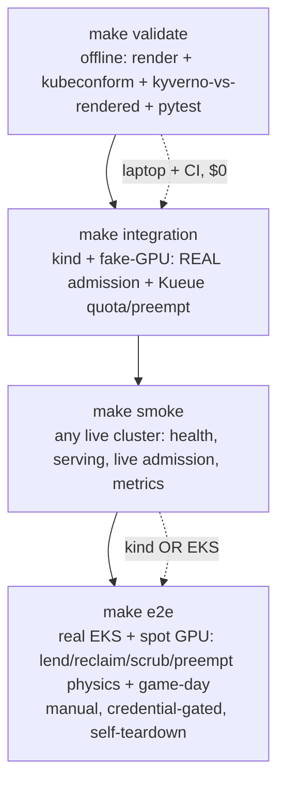

# Walking Skeleton — Deployable Platform + Live-Cluster Test Ladder - Plan

**Context:** builds on `docs/plans/2026-07-17-001-feat-eks-gpu-platform-plan.md` (the platform) and `eks-platform.prd.md`. This plan does not re-build the platform; it makes the existing repo **deployable and tested against real clusters** so it runs and can be built upon.

## Goal Capsule

- **Objective:** Turn the offline-validated repo into a walking skeleton: a thin real lending controller, a live-cluster test ladder (`kind` integration → smoke → real-GPU e2e), and a repeatable deploy — the thinnest slice through all four planes that actually runs and that every later unit extends.
- **Authority hierarchy:** the existing platform plan + `eks-platform.prd.md` (product intent) > this plan > repo conventions in `docs/conventions.md`.
- **Stop conditions:** a test tier that passes vacuously (asserts nothing) is a defect, not a pass; the e2e tier must never release held capacity or run without explicit AWS credentials.
- **Execution profile:** test-first where the tier is the deliverable (the tests ARE the product here); `make integration` runs on a laptop and in CI with zero cloud spend; `make e2e` is real-GPU, manual, gated.
- **Tail ownership:** the real lending-controller operator (beyond the v0 script), MIG, and multi-region remain later increments on this skeleton.

---

## Product Contract

### Summary

Four increments make the platform run and stay honest: (1) a `kind` integration tier that exercises the **real** Kyverno admission and Kueue quota/preemption against the repo's unmodified manifests using a fake GPU resource — $0, CI-able; (2) a thin real lending controller (script-in-Deployment) replacing the placeholder image so the lend/reclaim loop is deployable; (3) `make smoke` assertions runnable against any live cluster; (4) a scripted `make deploy` plus a real-GPU `make e2e` tier with a full execution runsheet. Karpenter provisioning and GPU physics stay in the e2e tier (unreachable on `kind`).

### Problem Frame

The repo is fully offline-provable (`make validate` + pytest) but nothing runs: the lending controller is a placeholder image, there is no live-cluster test, and deploy is a prose runbook. A reviewer cannot tell whether a merged, schema-valid change actually converges, whether admission really rejects an unsafe pod on a cluster, or whether the lend/reclaim loop works — the two P0s the review caught were exactly this class (rendered-vs-policy wiring). A walking skeleton with a live-cluster test ladder closes that gap and gives every future unit a base to extend and a test to pass.

### Requirements

**Test ladder**

- R1. A `kind`-based integration tier exercises the real policy plane (Kyverno + VAP) and real Kueue scheduling/quota/preemption against the repo's unmodified charts and policies, with no real GPU and no cloud spend, runnable locally and in CI.
- R2. A smoke tier asserts basic health and behavior against any live cluster (`kind` or EKS): workloads Ready, admission rejects a known-bad pod live, metrics reachable, attribution non-empty.
- R3. A real-GPU e2e tier proves the lend/reclaim/scrub/preemption physics and the game-day gate on spot GPU capacity; it is manual, credential-gated, and self-tearing-down.

**Deployability**

- R4. The lending controller is a real, deployable workload (not a placeholder image) that drives the lend/reclaim lifecycle from the git schedule.
- R5. A scripted, repeatable deploy stands up the platform from the bootstrap runbook with one entrypoint, credential-gated.

**Honesty**

- R6. No test tier passes vacuously; each tier's failure is a real signal. The tiers form a ladder — each runs a superset of confidence over the last.

### Success Criteria

1. `make integration` spins a `kind` cluster, installs the policy + scheduling planes, and fails when a customer-data pod tolerates lendable or when training exceeds its borrowing limit — the P0-class regressions caught as tests, in CI, for $0.
2. `make smoke` passes against a `kind` cluster today and against a real EKS pilot unchanged.
3. `make e2e` (run manually with AWS creds) demonstrates a GPU node lent → reclaimed ahead of a synthetic ramp → scrubbed → serving, under the p95 gate, then tears down with zero net capacity release.
4. The lending controller image is real and deployed (verified on kind in U4; on the real pilot via the U6 ArgoCD-synced deploy) and the lend/reclaim loop runs unattended.
5. `make deploy` reproduces the bootstrap for a second operator.

### Scope Boundaries

- **Out:** the full platform build-out (owned by plan 001); real customer traffic; multi-region; MIG/time-slicing; the production-grade controller operator (v0 is a script-in-Deployment — the operator is a follow-up).
- **Out (kind tier):** only the AWS-specific layer — `EC2NodeClass`, ODCR capture, real EC2 provisioning, node scrub-by-instance-termination, and DCGM GPU-physical metrics — is e2e-only. Karpenter's provider-agnostic core (NodePool scheduling, consolidation, drift, taints) *is* tested on kind via the kwok provider (KTD3).

#### Deferred to Follow-Up Work

- Real lending-controller operator (client-go/kopf reconcile loop) replacing the v0 script.
- e2e tier in scheduled CI against an ephemeral GPU account (this plan makes it manual/`workflow_dispatch`).
- Chaos/soak variants of the game-day beyond the four scripted scenarios.

---

## Planning Contract

### Key Technical Decisions

- KTD1. **Two distinct node substrates, kept separate — real kind workers for GPU pods, kwok virtual nodes for Karpenter-core only.** GPU workloads run on **real kind worker nodes** labeled/tainted as the GPU pools, where fake-gpu-operator's device-plugin DaemonSet (which needs a real kubelet) advertises synthetic `nvidia.com/gpu` — pods actually run, so **real** PriorityClass preemption and admission fire. The Karpenter **kwok** virtual nodes (KTD3) are a *separate* substrate for taint/drift/consolidation only: kwok nodes have no kubelet, so `image: fake` pods there never run — GPU workloads must never be scheduled onto them or U3's preemption would evict non-running pods. The two substrates coexist in one cluster but the GPU-pod scheduling path binds only to the real workers. Both test the **unmodified** charts/policies (real `nvidia.com/gpu`, real taints). Fallback if the operator is unavailable: node-status-patch on the real workers (`kubectl patch node ... status`) — still real admission, weaker preemption realism.
- KTD2. **Keep the real resource name and manifests; do not substitute a fake GPU resource.** Testing modified manifests proves nothing about production. The fake-ness is confined to *how the node advertises capacity*, never to the workloads or policies under test.
- KTD3. **Karpenter *core* is testable on `kind`; only the AWS-specific layer defers to e2e.** Karpenter ships an upstream **kwok cloud provider** (`sigs.k8s.io/karpenter/kwok`) that runs on kind and exercises the provider-agnostic core for real — NodePool scheduling, consolidation, drift, and taint/toleration behavior — using synthetic `karpenter.kwok.sh/*` instance types. What it **cannot** test (lives in `karpenter-provider-aws`, talks to real EC2): `EC2NodeClass`, ODCR capture, subnet/AMI resolution, and scrub-by-instance-termination — those defer to the e2e tier. So the integration tier installs the kwok provider and asserts NodePool taint/drift/consolidation; `EC2NodeClass` *schema* stays covered by offline `make validate`. (Note: the kwok provider's `karpenter.kwok.sh/*` labels do not work against the real AWS provider — they are test-only, never in the real overlays.)
- KTD4. **v0 lending controller = script-in-Deployment.** A small container running a `kubectl`-driven reconcile loop over `clusters/pilot/lending/schedule.yaml`: flip lendable-pool Node taints, patch the training ClusterQueue `borrowingLimit`, and drive scrub (on EKS: `nodeclaim` delete → fresh instance; on kind: node delete/recreate or logged no-op). Deployable now, exercises the real RBAC already written in `clusters/pilot/lending/lending-controller.yaml`, and is the base the real operator replaces. (Confirmed with user.)
- KTD5. **One test entrypoint per tier, same philosophy as `make validate`.** `make integration` / `make smoke` / `make e2e` — byte-identical local and CI where the tier runs in CI. Assertions are executable and specific; a green tier means a named behavior held.
- KTD6. **e2e is a runnable tier (cloud access assumed), gated for cost not capability.** The team has a cloud provider, so e2e is executed for real — scripts + `make e2e` + a step-by-step runsheet carrying the real-cluster gotchas (Karpenter ReservedCapacity feature flag, DCGM relabel, kube-state-metrics pod-label allowlist, balloon floor, spot GPU quota) as first-class content. It is manual / `workflow_dispatch` (kept out of per-PR CI to avoid spend, not because it can't run), refuses to run without credentials, and tears down after. (Confirmed with user; cloud access confirmed available.)

### Assumptions

- fake-gpu-operator installs cleanly on the pinned `kind`/k8s version; if it regresses, U1's node-status-patch fallback keeps the tier alive (KTD1). Revisit trigger: operator install fails in CI → switch U1 to the patch path, downgrade the preemption assertions in U3 to quota-only, note the gap.
- Kueue and Kyverno install on `kind` for testing (both are standard on kind in their own CI). Karpenter does not (KTD3).

### High-Level Technical Design

**The test ladder — each tier a superset of confidence, each a `make` target:**

**What each tier can and cannot see** (the boundary is KTD3):

| Concern | validate | integration (kind) | smoke (live) | e2e (GPU) |
|---|---|---|---|---|
| Chart renders / schema | ✓ | ✓ | | |
| Kyverno/VAP admission | rendered only | **real admission** | **real, live** | ✓ |
| Kueue quota / borrow / preempt | | **real (fake GPU)** | | ✓ |
| Karpenter NodePool sched / consolidate / drift / taints | schema | **✓ (kwok provider)** | | ✓ |
| Karpenter EC2NodeClass / ODCR / scrub-by-termination | schema | — (AWS-only) | | **✓ only here** |
| Node scrub = instance termination | | — (no-op/sim) | | **✓ only here** |
| GPU-physical (DCGM, kernel util) | | — | reachable-check | **✓ only here** |
| Render-start p95 gate | | | | **✓ only here** |

### Sequencing

Phase A (local, $0): U1 → U2, U3 (the integration tier — highest leverage, catches the P0 class). Phase B: U4 (real controller). Phase C: U5 (smoke, runs on the kind cluster U1 already builds). Phase D: U6 (deploy) → U7 (e2e scaffold+runsheet). Phase E: U8 (CI + docs). U2/U3 can parallelize once U1 exists.

---

## Implementation Units

| U-ID | Title | Key files | Depends on |
|---|---|---|---|
| U1 | kind + fake-GPU integration harness | `tests/kind/`, `Makefile` | — |
| U2 | Integration: real admission tests | `tests/integration/admission/` | U1 |
| U3 | Integration: Kueue quota/preemption tests | `tests/integration/scheduling/` | U1 |
| U4 | Thin real lending controller (v0) | `controllers/lending/`, `clusters/pilot/lending/` | — |
| U5 | make smoke (live-cluster) | `tests/smoke/`, `Makefile` | U1 |
| U6 | make deploy (scripted bootstrap) | `scripts/deploy.sh`, `infra/terraform/` | — |
| U7 | e2e tier + execution runsheet | `tests/e2e/`, `runbooks/e2e-gpu-run.md` | U4, U6 |
| U8 | CI wiring + test-ladder docs | `.github/workflows/`, `docs/explanation/testing.md` | U2, U3, U5 |

### U1. kind + fake-GPU integration harness

- **Goal:** A reproducible `kind` cluster that advertises `nvidia.com/gpu` on labeled/tainted GPU-pool nodes and has Kyverno + Kueue installed — the base every integration test runs against.
- **Requirements:** R1, R6
- **Dependencies:** none (needs `kind`, `docker`, `kubectl`, `helm` — `kind` not yet installed locally)
- **Files:** `tests/kind/cluster.yaml` (kind config pinned to a `kindest/node` image at **k8s ≥1.30** — ValidatingAdmissionPolicy v1 is GA only there, and U2's cross-namespace VAP test no-ops on an older node; real control-plane + GPU worker nodes labeled/tainted as `gpu-warm-floor` / `gpu-lendable` / `web` pools per `docs/conventions.md`, plus a `pool.synorg.io/name=web` node so the lending controller schedules), `tests/kind/up.sh` (create cluster; install fake-gpu-operator advertising `nvidia.com/gpu` on the **real GPU worker** nodes; install the **Karpenter kwok provider** for its own virtual nodes — no `nvidia.com/gpu`, taint/drift/consolidation only; install Kyverno + Kueue pinned to the repo versions; apply `policies/` and `clusters/pilot/kueue/`; **precheck** that `admissionregistration.k8s.io/v1` ValidatingAdmissionPolicy is served before tests run), `tests/kind/down.sh`, `tests/kind/README.md`, `Makefile` (`integration` target that calls up → run tests → down)
- **Approach:** KTD1/KTD2/KTD3 — two substrates, kept separate. Real GPU workers carry the pool taints and fake-gpu-operator capacity (pods run → real preemption); Karpenter kwok virtual nodes are a parallel substrate for NodePool taint/drift/consolidation, kept out of the GPU-pod scheduling path. Primary GPU path is the operator; `up.sh` falls back to node-status-patch on the real workers if the operator image is unavailable (KTD1). Do NOT modify any chart/policy — the harness adapts the node/provider, not the workload.
- **Execution note:** Smoke-verify the harness before writing assertions — `up.sh` then `kubectl get nodes -o custom-columns` shows the GPU capacity + taints; a probe pod requesting `nvidia.com/gpu` schedules onto a GPU node.
- **Patterns to follow:** `scripts/validate.sh` structure (need/fail helpers, single entrypoint); `docs/conventions.md` names verbatim.
- **Test scenarios:** `up.sh` produces nodes advertising `nvidia.com/gpu` with correct taints (assert via `kubectl get node -o json`); a probe GPU pod schedules; a non-GPU pod stays off GPU nodes; `down.sh` removes the cluster; re-running `up.sh` is idempotent. Fallback path: with the operator forced off, node-status-patch still advertises the resource.
- **Verification:** `make integration` reaches the test-run phase against a live kind cluster with GPU capacity present; teardown leaves no cluster.

### U2. Integration: real admission tests

- **Goal:** Prove the policy plane rejects unsafe pods and admits safe ones at **real cluster admission**, against rendered chart output — the P0-class regression net.
- **Requirements:** R1, R6
- **Dependencies:** U1
- **Files:** `tests/integration/admission/admission_test.sh` (or bats), `tests/integration/admission/fixtures/` (only where a rendered pod isn't derivable from the charts)
- **Approach:** `helm template` the golden + training charts and `kubectl apply --dry-run=server` (real admission webhooks fire) the rendered output; assert accept/deny. This is the live-admission complement to `make validate`'s offline `kyverno apply`.
- **Patterns to follow:** the policy fixtures in `policies/tests/`; the `make validate` composition stage (`scripts/validate.sh` section 3b) — same assertions, now at real admission.
- **Test scenarios:** customer-data GPU inference pod (from `ci/gpu-inference.yaml`) is **admitted** (tolerates warm-floor only); the same pod mutated to tolerate lendable is **denied** by tenancy-guard; a GPU pod with no team label is **denied** by require-team-label; the balloon Deployment pod (team+class labels) is **admitted**; a training pod tolerating warm-floor is **denied**; an inline Secret is **denied**, an ESO-managed one **admitted**; a cross-namespace ConfigMap/Secret ref is **denied** by the VAP (this is the tier that finally exercises the CEL policy, which has no offline test).
- **Verification:** every scenario’s admission verdict matches expectation on the live kind cluster; the mutated-lendable case fails exactly as the review P0 predicted.

### U3. Integration: Kueue quota/preemption tests

- **Goal:** Prove training borrows within quota, is blocked past it, and is preempted by inference — the lending scheduling semantics, on real Kueue with running (fake-GPU) pods.
- **Requirements:** R1, R6
- **Dependencies:** U1
- **Files:** `tests/integration/scheduling/scheduling_test.sh`, `tests/integration/scheduling/workloads/` (small inference + training Jobs sized to the fake GPU capacity)
- **Approach:** apply `clusters/pilot/kueue/` ClusterQueues/LocalQueues; run training up to the borrowing limit; shrink the limit (simulating the U4 controller / U8 schedule) and assert new training stops admitting; launch a high-priority inference pod and assert a training pod is **preempted** (real eviction — valid because fake-gpu-operator pods actually run, KTD1). Assert tenancy taints route pods to the right pool.
- **Execution note:** Start from a failing assertion — write the preemption test, watch it fail on an empty cluster, then wire the queues.
- **Patterns to follow:** `clusters/pilot/kueue/` objects; the plan-001 U6 test scenarios.
- **Test scenarios:** training admits only within `borrowingLimit`; a workload past the limit stays `Pending`/`Admitted:false`; shrinking the limit blocks new training; a pending `inference-critical` pod preempts a `training-preemptible` pod (assert the training pod is evicted); a training pod cannot schedule onto a warm-floor node (taint); **Karpenter-core (on the kwok virtual-node substrate, not the GPU workers): a NodePool provisions a node with the right taints, consolidation removes an empty lendable node, drift replaces a node on template change**; TAS/hot-swap is out of scope for kind (note it). The preemption scenarios above bind only to the real fake-GPU workers — never the kwok nodes (KTD1).
- **Verification:** borrow, block-past-limit, and preemption all observed on live kind; the preemption assertion evicts a real running pod.

### U4. Thin real lending controller (v0)

- **Goal:** Replace the placeholder image with a real, deployable controller that drives the lend/reclaim lifecycle from the git schedule.
- **Requirements:** R4
- **Dependencies:** none to build; **U1 at test time** (its scenarios and verification run in the kind harness). RBAC + Deployment shell exist in `clusters/pilot/lending/lending-controller.yaml`.
- **Files:** `controllers/lending/Dockerfile`, `controllers/lending/reconcile.sh` (the loop), `controllers/lending/README.md`, `clusters/pilot/lending/lending-controller.yaml` (point image at the built controller; keep the existing RBAC)
- **Approach:** KTD4 — a container running a `kubectl`-driven loop that reads the mounted `clusters/pilot/lending/schedule.yaml`, and on each tick: reconciles lendable-pool Node taints to the window state, patches the training ClusterQueue `borrowingLimit` to the curve value for the current time, and on a reclaim wave cordons+drains then deletes the `nodeclaim` (EKS) — on kind, **logs the intended action** (no Karpenter, and the granted ClusterRole has no `nodes: delete`, so no node deletion on kind). It patches **Node objects and the ClusterQueue only** — never NodePool templates (drift trap, per plan-001 U8). Region-local by construction. (Impl note: the container runs `readOnlyRootFilesystem: true`, so point `kubectl --cache-dir` at a writable `emptyDir` to keep the reconcile loop's logs clean.)
- **Execution note:** characterize the existing RBAC first — the controller must not need any verb beyond what `lending-controller.yaml` already grants; if it does, that is a finding, not a silent RBAC widening.
- **Patterns to follow:** `clusters/pilot/lending/schedule.yaml` schema; the plan-001 U8 emit-events + drift-trap constraints.
- **Test scenarios:** given a schedule with the window open, the controller adds the lent taint to lendable nodes; given a shrunk curve value, it patches the ClusterQueue `borrowingLimit` to match; a malformed schedule is rejected with a clear log, not a crash-loop; the controller uses only the granted RBAC verbs (assert against the Role); on kind, a reclaim tick logs the intended `nodeclaim` delete without erroring. Run these in the U1 kind harness.
- **Verification:** deployed to the kind cluster, the controller reconciles taints + `borrowingLimit` from a test schedule; U3's "shrink the limit" step can be driven by the controller instead of by hand.

### U5. make smoke (live-cluster)

- **Goal:** A fast health+behavior check runnable against any live cluster — the tier an operator runs post-deploy.
- **Requirements:** R2, R6
- **Dependencies:** U1 (for a cluster to run against)
- **Files:** `tests/smoke/smoke.sh`, `tests/smoke/README.md`, `Makefile` (`smoke` target, takes the current kubecontext)
- **Approach:** context-agnostic assertions: nodes Ready; if ArgoCD present, Applications Synced/Healthy; a golden service applied and Ready + a curl to its Service returns; a known-bad pod is rejected at live admission (reuses a U2 fixture); the Prometheus/metrics endpoint is reachable and a GPU-hour attribution query returns non-empty. Skips cloud-only checks gracefully when absent (kind has no ArgoCD/DCGM — assert-if-present).
- **Patterns to follow:** `make demo` (`scripts/demo.sh`) narration + read-only shape; `runbooks/game-day.md` PromQL patterns.
- **Test scenarios:** against the kind cluster: nodes Ready, golden service Ready + serves, bad pod denied live, ArgoCD/DCGM checks skip cleanly; the same script against a (mocked or real) EKS context runs the ArgoCD + metrics checks too; a down service or a passing-bad-pod makes smoke fail.
- **Verification:** `make smoke` green on the kind cluster from U1; the script is context-only (no hardcoded cluster) so it runs unchanged on EKS.

### U6. make deploy (scripted bootstrap)

- **Goal:** One credential-gated entrypoint that reproduces the platform bootstrap from the runbook.
- **Requirements:** R5
- **Dependencies:** none
- **Files:** `scripts/deploy.sh`, `infra/terraform/backend.tf.example` (remote state config), `Makefile` (`deploy` target), update `runbooks/deploy-platform.md` to point at the script
- **Approach:** wrap the `runbooks/deploy-platform.md` order (plan-001 U15 ODCR → plan-001 U2 mgmt+ArgoCD → plan-001 U3 pilot+Karpenter → register spoke → policy → scheduling → evidence) in a script that refuses to run without AWS credentials, runs `terraform apply` per module in order with the zero-net-release guard, and bootstraps ArgoCD. Idempotent; each step re-runnable.
- **Execution note:** this is mostly orchestration/config; prefer a dry-run/plan smoke (`terraform plan` per module, `--check`) over unit tests — it cannot fully run without an account.
- **Patterns to follow:** `runbooks/deploy-platform.md` (the authoritative order); `runbooks/capacity-carve.md` verify-before-terminate.
- **Test scenarios:** `make deploy` with no AWS creds exits clean with a clear message (no partial apply); `--plan` mode runs `terraform plan` for all modules without error; the step order matches the runbook; re-running after a partial apply resumes without duplicating reservations. `Test expectation: full apply is e2e-only (needs an account) — plan/dry-run is the local proof.`
- **Verification:** `terraform plan` succeeds for every module in order; the credential gate blocks a live apply without creds.

### U7. e2e tier + execution runsheet

- **Goal:** The real-GPU proof — lend/reclaim/scrub/preemption physics + the game-day gate on spot capacity — scaffolded to run and documented step-by-step.
- **Requirements:** R3
- **Dependencies:** U4 (controller), U6 (deploy)
- **Files:** `tests/e2e/run.sh` (stand up a spot-GPU pilot via `make deploy`, run the physics + game-day, tear down), `tests/e2e/assertions.sh`, `runbooks/e2e-gpu-run.md` (the execution runsheet), `Makefile` (`e2e` target, credential-gated), `.github/workflows/e2e.yaml` (`workflow_dispatch` only)
- **Approach:** KTD6. Not runnable from CI-by-default; `workflow_dispatch`/manual with an AWS account. The runsheet carries the gotchas as first-class ordered steps: enable Karpenter **ReservedCapacity** feature (or NodePools fall back to on-demand), DCGM exporter **relabel** for the node label, kube-state-metrics **pod-label allowlist** for attribution, confirm the **balloon floor** schedules, request **spot GPU quota** ahead of time. Assertions: a lent node is reclaimed ahead of a synthetic ramp, scrubbed (new instance-id), rejoins under the render-start p95 gate; the game-day storm scenarios pass; the capacity ledger shows zero net release; teardown removes everything.
- **Execution note:** smoke/runtime verification is the proof here, not unit tests — the deliverable is a runsheet + scripts that execute against a real account.
- **Patterns to follow:** `rehearsal/scenarios.yaml`, `runbooks/game-day.md`, `runbooks/node-scrub.md`, `runbooks/capacity-carve.md`.
- **Test scenarios:** (executed on a real account, documented as the runsheet) lend→reclaim→scrub cycle completes within the node return-to-service budget; scrubbed node has a new EC2 instance-id; storm scenario holds p95; ledger zero-net-release; `make e2e` without creds refuses to run; teardown verified idempotent. `Test expectation: execution is manual/gated — the scripts + runsheet are the shipped artifact; assertions run when an operator runs them.`
- **Verification:** `tests/e2e/run.sh --check` validates prerequisites and refuses without creds; the runsheet is complete enough that an operator runs the full cycle without inventing steps.

### U8. CI wiring + test-ladder docs

- **Goal:** Wire the integration tier into CI and document the ladder so the tiers are discoverable and enforced.
- **Requirements:** R6
- **Dependencies:** U2, U3, U5
- **Files:** `.github/workflows/integration.yaml` (kind-in-CI, runs U2+U3), update `.github/workflows/validate.yaml` (unchanged) references, `docs/explanation/testing.md` (the ladder: what each tier proves, the kind/Karpenter boundary), `docs/TODO-docs.md` (mark), `Makefile` help
- **Approach:** the integration workflow provisions kind (`helm/kind-action` or scripted), runs `make integration`; smoke and e2e are `workflow_dispatch`. The testing doc is Diátaxis **explanation** — why the ladder is shaped this way and what each tier can/can't see (the KTD3 boundary table).
- **Patterns to follow:** `.github/workflows/validate.yaml`; `docs/explanation/architecture.md` doc shape; the boundary table in this plan's HTD.
- **Test scenarios:** the integration workflow runs green on a PR touching `charts/` or `policies/`; a deliberately reintroduced P0 (chart tolerates lendable for customer-data) makes `make integration` fail in CI; the testing doc builds under `mkdocs --strict`.
- **Verification:** CI runs `make integration` on kind and fails on the seeded regression; `docs/explanation/testing.md` renders in the site nav.

---

## Verification Contract

| Gate | Command | Tier | Runs in |
|---|---|---|---|
| Offline | `make validate` | render + schema + kyverno-vs-rendered | laptop + CI (exists) |
| Bridge unit | `python3 -m pytest tools/env-spec-bridge/ -q` | python | laptop + CI (exists) |
| Integration | `make integration` | kind + fake-GPU: real admission + Kueue preemption | laptop + CI (new, U8) |
| Smoke | `make smoke` | any live cluster health/behavior | manual / post-deploy |
| Deploy dry-run | `make deploy --plan` | terraform plan all modules | manual (needs AWS read) |
| e2e | `make e2e` | real EKS + spot GPU physics + game-day | manual / `workflow_dispatch` |

Andon: any tier that goes red stops the line; a tier that asserts nothing is a defect (R6). The integration tier is the new CI gate; e2e stays manual.

---

## Definition of Done

Global:

- `make integration` builds a kind cluster, runs real admission + Kueue preemption assertions against unmodified charts/policies, and fails on a seeded P0 — green in CI for $0.
- `make smoke` passes on kind and is context-agnostic (runs unchanged on EKS).
- The lending controller is a real image, deployed, driving taints + `borrowingLimit` from the schedule using only its existing RBAC.
- `make deploy --plan` succeeds for every terraform module in order; live apply is credential-gated.
- `make e2e` + `runbooks/e2e-gpu-run.md` are complete enough to run the real-GPU lend/reclaim/game-day cycle; the target refuses without creds.
- `docs/explanation/testing.md` documents the ladder + the kind/Karpenter boundary and renders in the docs site.
- Cleanup: no placeholder controller image references remain; no test passes vacuously.

Per-unit: each unit's Verification bullet holds with evidence.

---

## Risks & Dependencies

| Risk | Impact | Mitigation |
|---|---|---|
| fake-gpu-operator regression on pinned kind/k8s | integration tier can't advertise GPU | node-status-patch fallback in U1 (KTD1); preemption assertions degrade to quota-only, gap noted |
| Assuming kind covers more Karpenter than it does | false confidence | KTD3 boundary explicit + the HTD table: kwok tests NodePool core; EC2NodeClass/ODCR/scrub-by-termination are e2e-only, never claimed by integration |
| v0 script controller drifts from real operator semantics | later operator swap surprises | v0 uses the same schedule + RBAC + Node/ClusterQueue-only write surface as the operator will; documented as the contract |
| e2e needs a real account + spot GPU quota | can't run in default CI | manual/`workflow_dispatch`, credential-gated, quota called out in the runsheet as a pre-req |
| `kind` not installed locally | U1 blocked | U1 prereq: `brew install kind` (documented in `tests/kind/README.md`) |

Upstream: `kind`, fake-gpu-operator image, pinned Kyverno/Kueue versions; an AWS account for U6 live apply + U7 e2e.

---

## Appendix: Sources

- `docs/plans/2026-07-17-001-feat-eks-gpu-platform-plan.md` — the platform being made deployable/testable; U6/U8 semantics reused.
- run-ai **fake-gpu-operator** (<https://github.com/run-ai/fake-gpu-operator>) — device-plugin advertises synthetic `nvidia.com/gpu` on plain kind nodes; pods run (real preemption). Basis for KTD1.
- **kind-gpu-sim** (<https://github.com/maryamtahhan/kind-gpu-sim>) — node-status-patch + device-plugin approach; the U1 fallback path.
- **kwok** (<https://kwok.sigs.k8s.io>) — fake nodes; `image: fake` pods don't run → admission/quota only, not container/preemption. Rejected as primary for KTD1.
- Karpenter **kwok provider** (<https://github.com/kubernetes-sigs/karpenter/blob/main/kwok/README.md>) — runs on kind and tests the provider-agnostic core (NodePool scheduling, consolidation, drift, taints) via `karpenter.kwok.sh/*` fake instance types; `EC2NodeClass`/ODCR/real-EC2 logic lives in `karpenter-provider-aws` and is e2e-only. Basis for KTD3.
