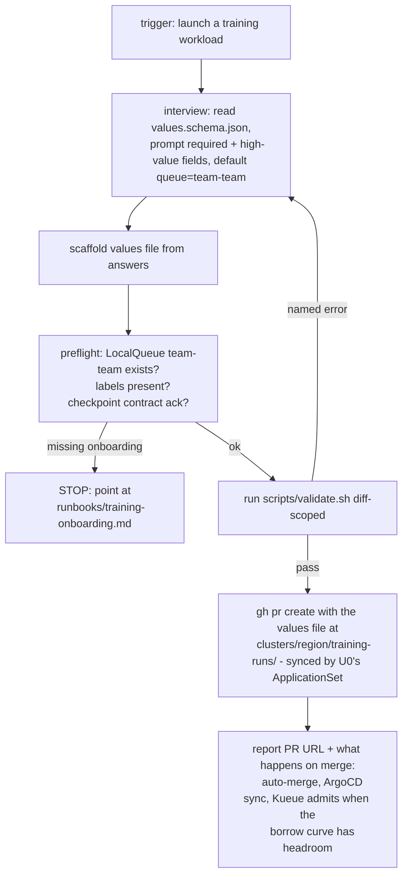

# feat: Launch-training-workload skill for R&D engineers

## Summary

A Claude Code skill that walks an R&D engineer from "I want to train" to a
validated, PR-submitted `training-job` workload — without touching `kubectl`
or holding cluster credentials. It interviews for the handful of required
inputs, scaffolds a schema-valid values file, runs the same `make validate`
gate CI runs, pre-flights the team's onboarding state, and opens the PR. This
is the human/agent on-ramp to the platform's git-only-write contract: a
training run becomes a namespace-scoped non-prod change that the autonomous
capability tier auto-merges and ArgoCD syncs.

---

## Problem Frame

Launching a training workload today means reading `runbooks/training-onboarding.md`
end to end (7 steps), hand-authoring a values file against
`charts/training-job/values.schema.json`, remembering the non-negotiable labels
and the checkpoint contract, and knowing that `git` is the only write path. The
runbook's own Step 6 shows a `helm template | kubectl apply` shortcut that
requires cluster credentials and sidesteps GitOps — the exact thing the platform
sells against. An R&D engineer who just wants to train shouldn't need to
internalize the platform's tenancy and lending model to submit one job.

The skill closes that gap: it encodes the runbook's knowledge as a guided flow,
enforces the schema and label guardrails before the PR (not after a reviewer
catches them), and keeps the engineer on the credential-free PR path.

---

## Requirements

- **R1.** Guided input capture for every schema-required field (`team`, `queue`,
  `gpu`, `image.repository`, `image.tag`) plus the high-value optionals
  (`workers`, `checkpoint.dir`, `checkpoint.intervalSeconds`), defaulting where
  convention allows (`queue = team-<team>`).
- **R2.** Produce a values file that passes `charts/training-job/values.schema.json`
  and the `make validate` gate unchanged — no bespoke re-implementation of the
  schema.
- **R3.** Run the repo's own validation (`scripts/validate.sh`, diff-scoped) and
  surface the named error on failure, looping back to correct rather than
  submitting a broken run.
- **R4.** Pre-flight the team's platform state: the `team-<team>` LocalQueue
  exists (team onboarded), required labels are present, and the checkpoint
  contract is acknowledged.
- **R5.** Submit via PR only — no `kubectl`, no cluster credentials. The skill
  opens a pull request carrying the values file at the location ArgoCD syncs.
- **R6.** Never actuate cluster state directly. The skill is an agent principal:
  it proposes (PR), it does not apply. (Mirrors `docs/agent-interface.md`.)

---

## Scope Boundaries

**In scope:** a single new Claude Code skill under `.claude/skills/` that
launches `training-job` workloads through the PR path.

### Deferred to Follow-Up Work

- **Inference / golden-service launches.** A parallel skill for `charts/golden-service`
  is a natural sibling but a distinct schema and deploy lane; out of this plan.
- **The `kubectl apply` fast path.** Runbook Step 6's credentialed shortcut is
  deliberately excluded (R5/R6). If demand appears, add it later behind an
  explicit opt-in, not as a default.
- **Team onboarding.** Creating a team's namespace, LocalQueue, and checkpoint
  PVC (runbook Steps 1–5) stays with `runbooks/training-onboarding.md`; the
  skill *detects* a missing LocalQueue and points at that runbook rather than
  provisioning it.

---

## Key Technical Decisions

- **KTD1 — PR-first, credential-free (R5/R6).** The skill's terminal action is
  `gh pr create`, not a cluster write. A training run is a namespace-scoped
  non-prod change → autonomous capability tier → auto-merge → ArgoCD sync
  (`docs/capability-tiers.md`). This keeps the engineer (or an agent running the
  skill) a pure git principal. **Load-bearing:** the sync link for training runs
  does not exist in the repo today (only `services` and region overlays are
  synced — verified 2026-07-20); U0 adds it, or the PR merges and nothing
  deploys.
- **KTD2 — The chart schema is the single source of truth (R2).** The skill
  reads `charts/training-job/values.schema.json` to drive the interview and
  validate the scaffold; it does not hardcode the field list. Schema changes
  propagate to the skill for free.
- **KTD3 — Reuse `scripts/validate.sh`, don't reimplement (R3).** The skill
  shells the repo's own diff-scoped validation so the skill's "valid" and CI's
  "valid" can never diverge.
- **KTD4 — Detect, don't provision (R4).** Missing team onboarding is a
  hard stop with a pointer to the runbook, not something the skill fixes — that
  path touches cluster-scoped resources (a different capability tier).

---

## High-Level Technical Design

The skill is a linear guided flow with one correction loop at the validation
gate. It never branches into a credentialed path.

Authoritative content; prose governs on any disagreement.

---

## Implementation Units

### U0. Platform prerequisite — `training-runs` ApplicationSet

**Goal:** Give a committed training-run values file an ArgoCD sync path, so a
merged PR actually launches the Job (closes the gap that `services` closed for
inference).
**Requirements:** R5 (the PR path must deploy on merge).
**Dependencies:** none. **Blocks U5.**
**Files:**
- `clusters/mgmt/appsets/training-runs.yaml` (create)
- `clusters/mgmt/appsets/regions.yaml` (modify — exclude the `training-runs`
  dir from the `clusters/{{.name}}/*` glob, exactly as `services` is excluded,
  so the two ApplicationSets don't double-apply it)
**Approach:** Near-copy of `clusters/mgmt/appsets/services.yaml`: matrix of the
spoke Cluster generator × a Git **file** generator over
`clusters/{{.name}}/training-runs/*.yaml` (one Application per run file, file
contents become params); multi-source rendering through `charts/training-job`
via the `$values` ref pattern; destination namespace `team-{{.team}}` from the
file's `team` key. Sync policy note: Jobs are terminal — keep `prune: true`
(deleting the run file removes the Job) but confirm `selfHeal` behavior against a
completed Job doesn't thrash (a finished Job's status is stable; ArgoCD won't
recreate it unless the spec changes).
**Patterns to follow:** `clusters/mgmt/appsets/services.yaml` (the file-generator
+ multi-source shape, verbatim structure); the `services` exclude line in
`clusters/mgmt/appsets/regions.yaml`.
**Test scenarios:**
- `make validate` renders both ApplicationSets without error.
- A sample `clusters/pilot/training-runs/<run>.yaml` renders through
  `charts/training-job` (helm template) to a valid suspended Job with the
  `team-<team>` namespace and Kueue queue label.
- The `regions` ApplicationSet no longer claims the `training-runs` dir (no
  duplicate Application for it).
**Execution note:** this is GitOps wiring — prefer a render/validate smoke
(`scripts/validate.sh` + a manual `helm template` of a sample run file) over unit
coverage. Live convergence is proven when the skill's first end-to-end run lands.
**Verification:** a values file committed under `clusters/<region>/training-runs/`
produces one ArgoCD Application that syncs a suspended Job.

### U1. Skill skeleton and trigger

**Goal:** A discoverable skill that fires on a launch-a-training-workload intent.
**Requirements:** R1 (entry).
**Dependencies:** none.
**Files:**
- `.claude/skills/launch-training/SKILL.md` (create)
**Approach:** Follow the repo's skill convention (frontmatter `name`,
`description`; see `.claude/skills/grill-me/SKILL.md` for shape). Unlike the
grilling skills, this one is model-invocable — omit `disable-model-invocation`
so "launch a training workload" / "submit a training run" triggers it, plus a
`/launch-training` slash form. The SKILL.md is the orchestration narrative;
per-step detail lives in reference assets added by later units.
**Patterns to follow:** existing `.claude/skills/*/SKILL.md` frontmatter and
prose style.
**Test scenarios:** `Test expectation: none -- prompt asset, no behavioral code.`
Manual: the skill appears in the skill list and triggers on the natural-language
phrase and the slash form.
**Verification:** invoking the trigger loads the skill and begins the interview.

### U2. Schema-driven interview and scaffold

**Goal:** Turn `values.schema.json` into an interview, emit a valid values file.
**Requirements:** R1, R2.
**Dependencies:** U1.
**Files:**
- `.claude/skills/launch-training/references/interview.md` (create)
- `.claude/skills/launch-training/references/values-template.md` (create)
**Approach:** Read `charts/training-job/values.schema.json` at run time; prompt
for each `required` field and the high-value optionals (`workers`,
`checkpoint.*`). Apply the one convention default (`queue = team-<team>`) and
the schema's own defaults for the rest. Emit `my-run.yaml`-shaped values mirroring
`charts/training-job/ci/basic-training.yaml`. Do not duplicate the field list in
prose — derive it from the schema so it can't drift.
**Patterns to follow:** `charts/training-job/ci/basic-training.yaml` (canonical
minimal values); the schema's `required`/`properties`.
**Test scenarios:**
- Happy path: all required answers → scaffold validates against the schema
  (feed it through U3's gate).
- Edge: omitted optional (`workers`) → schema default applied, still valid.
- Edge: `queue` left blank with `team=ml` → defaults to `team-ml`.
- Error: `checkpoint.intervalSeconds > 300` → rejected at scaffold time with the
  schema's cap message (KTD12 / 300 s lost-work budget), interview re-prompts.
**Verification:** the emitted file passes `values.schema.json` for representative
inputs.

### U3. Validation-gate integration

**Goal:** Gate on the repo's own validation before any PR.
**Requirements:** R3.
**Dependencies:** U2.
**Files:**
- `.claude/skills/launch-training/references/validate.md` (create)
**Approach:** Shell `scripts/validate.sh` (the `make validate` entrypoint:
helm template → kubeconform → kyverno test, diff-scoped). On non-zero exit,
capture the named error and route back to U2's interview for the offending
field; never proceed to PR on a failed gate (Andon: stop the line).
**Execution note:** prefer a runtime smoke of `scripts/validate.sh` against a
known-good and a known-bad values file over unit coverage — this unit is
integration glue.
**Patterns to follow:** `scripts/validate.sh`; the Makefile `validate` target.
**Test scenarios:**
- Happy path: valid scaffold → validation passes → flow continues.
- Error: schema-invalid values (missing `image.tag`) → validation fails, named
  error surfaced, flow loops back, no PR opened.
- Integration: a kyverno-denied shape (e.g., missing `team.synorg.io/name`
  label) → caught here, not after PR.
**Verification:** a deliberately broken values file never reaches PR creation.

### U4. Pre-flight checks (detect, don't provision)

**Goal:** Confirm the team is onboarded and the run is well-formed before PR.
**Requirements:** R4, R6.
**Dependencies:** U2.
**Files:**
- `.claude/skills/launch-training/references/preflight.md` (create)
**Approach:** Read-only checks: does a `team-<team>` LocalQueue manifest exist in
the repo (proxy for onboarding — `clusters/pilot/kueue/localqueue-*.yaml`)? Are
the non-negotiable labels present in the rendered Job? Has the engineer
acknowledged the checkpoint contract (image resumes from `CHECKPOINT_DIR`)? A
missing LocalQueue is a hard stop pointing at `runbooks/training-onboarding.md`
Steps 1–5 — the skill does not create cluster-scoped resources (KTD4).
**Patterns to follow:** `runbooks/training-onboarding.md` Steps 3–5;
`clusters/pilot/kueue/localqueue-team-example.yaml`.
**Test scenarios:**
- Happy path: onboarded team → all checks pass.
- Error: no `team-<team>` LocalQueue → hard stop with the runbook pointer, no PR.
- Edge: checkpoint contract not acknowledged → skill blocks and explains the
  ≤5 min lost-work budget before continuing.
**Verification:** an un-onboarded team cannot open a PR; the message names the
runbook.

### U5. PR submission on the synced path

**Goal:** Open the PR carrying the values file where a merge actually launches
the run.
**Requirements:** R5, R6.
**Dependencies:** U0 (sync path), U3, U4.
**Files:**
- `.claude/skills/launch-training/references/submit.md` (create)
**Approach:** Write the values file to `clusters/<region>/training-runs/<run>.yaml`
(the path U0's ApplicationSet syncs), branch, `gh pr create` with a body that states team, GPUs, image, and
the checkpoint contract. Report the PR URL and what happens on merge: autonomous
tier auto-merge → ArgoCD sync → Job created suspended → Kueue admits when the
borrow curve has headroom (`runbooks/training-onboarding.md` Step 6). No
`kubectl`, no apply.
**Execution note:** smoke the PR body rendering and path placement against OQ1's
resolved location; do not open a real PR in tests.
**Patterns to follow:** repo `gh pr create` usage; capability-tier autonomous
lane in `docs/capability-tiers.md`.
**Test scenarios:**
- Happy path: validated + pre-flighted run → PR opens at the synced path with a
  complete body.
- Error: `gh` unauthenticated → clear failure, values file preserved locally for
  a manual PR, no partial state.
- Edge: dry-run/preview mode → shows the diff and target path without opening a
  PR.
**Verification:** the opened PR, when merged, is a namespace-scoped non-prod
change ArgoCD syncs; nothing was applied directly.

### U6. Skill docs and runbook cross-link

**Goal:** Make the skill self-documenting and tie it to the manual runbook.
**Requirements:** R1–R6 (discoverability).
**Dependencies:** U1–U5.
**Files:**
- `.claude/skills/launch-training/README.md` (create)
- `runbooks/training-onboarding.md` (modify — add a one-line "or use the
  `/launch-training` skill" pointer at Step 6)
**Approach:** Short README: what it does, the PR-only contract, when to fall back
to the manual runbook. Add the reciprocal pointer in the runbook so a reader of
either lands on the other.
**Patterns to follow:** existing skill READMEs; the runbook's prose voice.
**Test scenarios:** `Test expectation: none -- docs.` Manual: both cross-links
resolve on GitHub.
**Verification:** runbook Step 6 references the skill; skill README references
the runbook.

---

## Open Questions

- **OQ1 — RESOLVED (2026-07-20).** Checked the ApplicationSets: `services` syncs
  `clusters/<region>/services/*.yaml` (inference values) and `regions` syncs the
  `clusters/<region>/*` platform overlays — **nothing syncs training Jobs** today
  (they use the runbook's ad-hoc `kubectl apply`). Answer is (b): a platform
  prerequisite is needed, now captured as **U0** (a `training-runs` ApplicationSet
  mirroring `services`). U5 depends on U0.
- **OQ2 (non-blocking) — Slash vs natural-language trigger only.** U1 assumes
  both; confirm the repo's preference for slash commands vs model-invocation for
  contributor-facing skills.

---

## Verification Contract

- The skill scaffolds a values file that passes `charts/training-job/values.schema.json`
  and `scripts/validate.sh` for representative inputs (R2, R3).
- A schema-invalid or kyverno-denied run never reaches PR creation (R3).
- An un-onboarded team is hard-stopped with a runbook pointer (R4).
- The skill's only state-changing action is `gh pr create`; no `kubectl`/apply
  path exists in any unit (R5, R6).
- Both cross-links (skill ↔ runbook) resolve (U6).

## Definition of Done

- `.claude/skills/launch-training/` exists with SKILL.md + reference assets +
  README, triggering on the launch intent.
- End-to-end dry run: interview → scaffold → validate → preflight → PR-preview
  succeeds on a known-good input and fails closed on a bad one.
- U0's `training-runs` ApplicationSet is merged and a sample run file syncs a
  suspended Job; U5 targets `clusters/<region>/training-runs/`.
- `make validate` stays green; runbook cross-link committed.

---

## Sources & Research

- `charts/training-job/values.schema.json`, `charts/training-job/values.yaml`,
  `charts/training-job/ci/basic-training.yaml` — the workload contract.
- `runbooks/training-onboarding.md` — the manual 7-step flow this skill encodes.
- `docs/capability-tiers.md` — why a namespace-scoped non-prod run auto-merges.
- `docs/agent-interface.md` — agents are principals that propose, not apply (R6).
- `scripts/validate.sh`, `Makefile` (`validate` target) — the reused gate.
- `.claude/skills/grill-me/SKILL.md` — skill frontmatter/prose convention.
