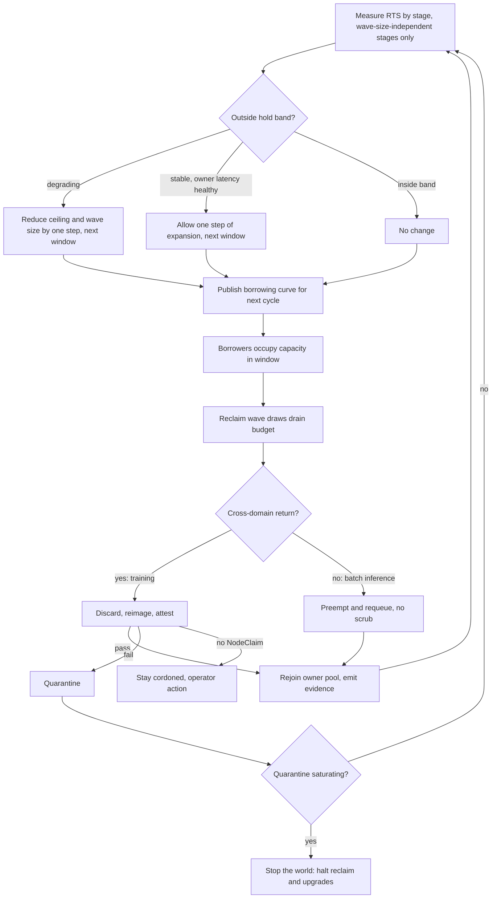
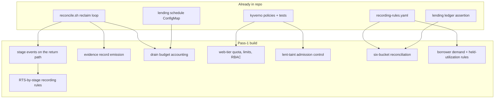

# Capacity-Time Tenancy - Plan

## Goal Capsule

- **Objective:** Make return-to-service p95 the governor of GPU lending, so the platform can sell idle capacity without ever spending the owner's latency floor or losing held inventory.
- **Product authority:** `eks-platform.prd.md` (FR1, FR2, FR7, NFR1, NFR4), ADR 0001, ADR 0005, ADR 0008, ADR 0009, `docs/capability-tiers.md`, `docs/value-case.md`.
- **Audience:** the target organization — a platform team, an SRE/capacity function, and a security engineering function. The current repository is a single-operator pilot; see Dependencies and Assumptions.
- **Open blockers:** none for the first pass. Every threshold-dependent requirement is deferred to a second pass — see Sequencing, which also carries the accepted-risk statement pass 1 requires before running at production scale.

---

## Product Contract

### Summary

GPU-tier tenancy allocates capacity by time through an aggregate, schedule-driven borrowing ceiling rather than per-tenant lease objects, with return-to-service p95 as the control-loop governor that throttles lending ceiling and reclaim wave size across lending cycles. Drain budget becomes an accounted resource that reclaim and upgrades draw from under one policy, attestation is budgeted inside the return path instead of treated as an independent control, and the web tier gets conventional namespace tenancy on a separate track.

### Problem Frame

GPU supply is non-elastic. Held capacity is never descaled because released capacity may not be re-acquirable, so the fleet runs ~90% idle overnight while R&D buys separate GPUs to train on.

That premise breaks the standard playbook. Elastic-supply thinking treats idle as waste and prescribes scale-down, which would destroy the inventory the business depends on. It also prescribes per-team quota as the tenancy control, which reserves capacity per owner — the opposite of what lending needs, since lending requires capacity to be fungible across owners.

The primary cost is not the training-capacity double-pay. `docs/value-case.md` puts training-substitute recovery at roughly 2-6% of burn and states plainly that lending does not pay for the fleet. The real exposure is a large standing hold whose correct size nobody can currently evidence, plus an isolation boundary that must be auditable if the held fleet is ever to be shared. Training-capacity recovery is a secondary, marginal benefit on top.

The harder problem is that "lend" is not a scheduling decision. For cross-domain borrowing it is a round trip: drain, scrub, reimage, attest, rejoin. Two different trust boundaries — customer inference and internal R&D training — occupy the same physical device across time, and namespaces do not reset GPU memory. Every step of that round trip consumes wall-clock during the window where the owner's latency floor matters most, and the same drain capacity is what cluster upgrades need. Nothing in the current design accounts for that contention, and the existing conservation evidence does not yet decompose into the states the fleet actually occupies.

### Key Decisions

- **Capacity-time tenancy, expressed as a curve rather than leases.** The tenant is whoever holds capacity right now, not whoever owns the node. The GPU tier has more than one borrower by design — ADR 0009 adds `batch-inference-borrow` to the same `gpu-lending` cohort — so the justification is not borrower count. It is that contention between borrower classes is already arbitrated by Kueue priority within the cohort, and demand is diurnal and predictable, so an aggregate borrowing ceiling on a schedule delivers time-tenancy semantics without a second scheduler. Lease objects earn their cost when observed contention exceeds what priority ordering resolves; R2 makes that trigger measurable.

- **RTS p95 is the governor, not just a budget.** Return-to-service p95 is a control-loop input: when it degrades, lending ceiling and wave size reduce; when it improves with owner latency stable, lending can expand. The governor acts across cycles, not within one (R26), and damps its own feedback (R27).

- **Attestation is inside the RTS budget.** Attestation and drain budget are not independent controls — attestation extends the same return path the drain budget exists to protect. Enabling stronger attestation without re-deriving the owner floor silently borrows against the owner's SLO.

- **Systemic attestation failure is a capacity incident with a security veto.** A bad golden image quarantines inventory already promised back to the owner, so the capacity runbook drives the response. But the failure is security-shaped in origin, and the party under SLO pressure is not the party positioned to judge whether the image issue is resolved — so clearing quarantine requires security sign-off (R17).

- **Tenancy splits by tier, not by team.** GPU tier uses capacity-time tenancy; web tier uses namespace, quota, and RBAC with team as the boundary. This keeps the two conflicting models apart without requiring separate platform organizations to exist first.

- **Conservation extends the existing ledger.** The lending ledger already asserts zero net capacity release across a cycle and has fired on a live run. The gap is not that nothing proves return — it is that the assertion is a single boolean rather than a reconciliation that decomposes into the states capacity actually occupies. R18-R20 extend that ledger; they do not stand up a second accounting surface that could disagree with it.

- **Instrument before tuning.** Nearly every threshold in this contract is parameterized on stage-decomposed RTS, which does not exist yet even though a whole-path budget figure does. Building the measurement and evidence surfaces first, then setting thresholds against real data, avoids tuning against a figure whose composition is unknown. This splits delivery into two passes with a defined gate (AE7), not an open-ended deferral.

### Actors

- A1. Capacity owner — production realtime inference. Holds the latency floor and the never-lent capacity floor.
- A2. Borrower, cross-domain — R&D training. Checkpoint-tolerant, preemptible, never preempts. Its return crosses a trust boundary and is scrub-bounded.
- A3. Platform team — owns the substrate, the borrowing curve, the drain budget, and reclaim orchestration.
- A4. Security engineering — owns scrub, golden-image promotion, attestation, and the evidence chain.
- A5. Agent principals — open pull requests and read the evidence and SLO APIs. Hold no cluster credentials.
- A6. Borrower, same-domain — batch inference (ADR 0009). Soft-SLA and Kueue-admitted, but same trust domain as realtime, so its return needs no scrub and does not traverse the lending controller's node lifecycle.

### Requirements

**Tenancy mechanism**

- R1. GPU-tier capacity is allocated by time through an aggregate, schedule-driven borrowing ceiling rather than per-tenant lease objects.
- R2. A graduation trigger from curve to lease objects is stated as observed contention between borrower classes, measured by the signals in R28, rather than as borrower cardinality.
- R3. Owner floor and lender ceiling are structurally separate pools: a never-lent floor distinct from the lendable pool, ratifying `clusters/pilot/karpenter/nodepool-gpu-warm-floor.yaml` and the tenancy-guard policy that denies training tolerating it. Sizing the floor is R8.
- R4. Reclaim honors the KTD12 eviction contract — 5-minute checkpoint cadence, 120-second termination grace, 5-minute lost-work budget — as already implemented in `drainGraceSeconds` on every reclaim wave.

**Return-to-service governor**

- R5. RTS p95 is measured end-to-end from drain-start to rejoined-and-serving-at-SLO, decomposed by stage: scrub, reimage, attest, orchestration. The attest stage is declared but unpopulated until R13 lands.
- R6. RTS p95 governs the lending ceiling and reclaim wave size, reducing both when it degrades.
- R7. Any change that extends the return path requires re-deriving the owner floor before it ships.
- R8. Wave lead time, maximum lending-window length, and never-lent floor size are all derived from RTS rather than set independently.
- R26. The governor's control period is one lending cycle. Ceiling and wave-size changes apply to the next window, not the one in flight; protection during a degrading reclaim comes from the owner floor and the drain budget, not from the governor.
- R27. The governor reacts to the wave-size-independent RTS stages rather than to total RTS, changes ceiling and wave size by at most one step per control period, and holds inside a stated band where no change is made.

**Drain budget**

- R9. Concurrent drains are bounded by an accounted budget shared across reclaim and upgrades.
- R10. Reclaim holds first claim on drain budget; upgrades consume the remainder.
- R11. Upgrade waves are scheduled against that budget with stop conditions tied to the owner floor and RTS p95.

**Boundary completion and evidence**

- R12. A cross-domain borrowed node rejoins the owner pool only after the instance is discarded and re-created, so GPU memory and local disk do not survive the boundary. Same-domain borrowing (A6) is exempt by ADR 0009. Where instance replacement cannot complete, the node stays cordoned rather than rejoining — the invariant rests on that cordon holding.
- R13. Node return requires attestation that the node booted the expected image, verifiable after the fact.
- R14. Each return emits an evidence record linking borrow window, node identity, scrub outcome, image digest, and attestation result. Records are tamper-evident, and the contract names who may amend them. Until R13 lands, the attestation field carries an explicit not-enforced value rather than an empty or assumed result.
- R15. Golden images promote through a canary cohort with rollback criteria tied to attestation pass rate and RTS p95.
- R16. Quarantine has a sized pool and a stop-the-world threshold; approaching saturation halts further reclaim and upgrades.
- R17. Systemic attestation failure pages capacity on-call and security on-call and is handled by a capacity runbook, but clearing quarantine or rolling back a golden image requires security on-call sign-off.

**Conservation accounting**

- R18. Each cycle reconciles six buckets: held, owner-serving, owner-idle-floor, lent, quarantine, in-transit.
- R19. A reconciliation mismatch is treated as a capacity incident until explained.
- R20. Conservation proof is reported as a first-class KPI alongside consumption metrics, never in place of them.
- R28. The evidence plane emits per-borrower-class queued GPU-hours and admission wait time, plus lendable-window utilization of held capacity, so R2's graduation trigger and the keep-or-shrink decision on the held book both have a measurable basis.

**Web-tier tenancy**

- R21. Web tier enforces `ResourceQuota`, `LimitRange`, and per-team RBAC, with team as the isolation boundary.
- R22. Web-tier tenancy ships on its own schedule and depends on no GPU-tier decision.

**Interface**

- R23. Capacity requests, borrow-window changes, and reclaims are expressed as pull requests validated in CI; agents hold no cluster credentials.
- R24. CI returns a machine-readable decision receipt with structured reasons on both admit and deny.
- R25. No second write path exists — no portal or manual override writes to the cluster outside time-bounded, logged break-glass. Break-glass excludes returning a GPU-tier node to owner-served state: it may not clear the lent taint, and any node touched under break-glass while lent is forced back through R12 and R13 before it may serve owner workload.

### Sequencing

Delivery splits into two passes. The boundary is whether a requirement needs a number that only stage-decomposed measurement can supply.

**Pass 1 — instrumentation, evidence, and requirements already satisfied by existing behavior.** R1, R3, R4, R5, R9, R10, R12, R14, R18, R19, R20, R21, R22, R23, R24, R25, R28. Pass 1 produces the RTS stage decomposition, the extended ledger reconciliation, the evidence chain, borrower-demand signals, and web-tier tenancy.

**Pass 2 — everything parameterized on measured RTS.** R2, R6, R7, R8, R11, R13, R15, R16, R17, R26, R27. Pass 2 sets the governor's response curve and its control period, sizes the never-lent floor and quarantine pool, schedules upgrade waves against stop conditions, and enables attestation. Attestation lands here because its cost model is the RTS headroom pass 1 measures.

**Pass-1 interim risk — must be accepted explicitly before production scale.** Pass 1 runs live lending and reclaim with instance discard and re-creation as the sole cross-domain boundary control. Attestation is not enforced, so a node booting an unexpected image after discard has no check before it rejoins the owner pool. Canary gating for golden images (R15) is also unavailable, since its criteria depend on attestation pass rate. This window is bounded by the calendar deadline in AE7, independent of when RTS stabilizes; running past that deadline without attestation requires a new accepted-risk decision, not silence.

Pass 2 opens on the gate in AE7.

### Key Flows

- F1. Scheduled lend and reclaim
  - **Trigger:** The published borrowing curve opens a window.
  - **Actors:** A1, A2, A3, A6
  - **Steps:** The curve admits borrowed occupancy up to the ceiling, with Kueue priority arbitrating between borrower classes; ahead of the owner's demand ramp the ceiling shrinks; reclaim waves draw drain budget and drain nodes with wave lead time derived from RTS.
  - **Outcome:** Capacity returns to the owner before the ramp, with the never-lent floor untouched throughout.
  - **Covered by:** R1, R3, R4, R8, R9, R10, R26

- F2. Node return with boundary completion
  - **Trigger:** A drained node leaves borrowed occupancy.
  - **Actors:** A3, A4
  - **Steps:** For a cross-domain return the instance is discarded and re-created, the replacement attests against the expected image, and on pass it rejoins the owner pool with an evidence record written; on fail it routes to quarantine; where no instance replacement is possible it stays cordoned. Same-domain returns preempt and requeue without scrub.
  - **Outcome:** From pass 2, no node serves owner workload without proof of boundary completion. In pass 1 the proof is discard-and-recreate alone, recorded as such.
  - **Covered by:** R12, R13, R14, R17

- F3. Golden image failure to systemic quarantine
  - **Trigger:** A promoted image fails attestation across a cohort rather than on one node.
  - **Actors:** A3, A4
  - **Steps:** Canary gates catch the failure before broad promotion; if it escapes, quarantine fills, the saturation threshold halts further reclaim and upgrades, and both on-call rotations page. Security on-call signs off before quarantine clears.
  - **Outcome:** Trapped inventory is bounded and the owner floor is defended before rollback completes.
  - **Covered by:** R15, R16, R17

### Acceptance Examples

- AE1. **Covers R6, R7, R26.** Given RTS p95 rises above budget during a morning reclaim, when the governor next acts, then the ceiling and wave size reduce for the following window and the in-flight reclaim is protected by the owner floor and drain budget instead.
- AE2. **Covers R9, R10, R11.** Given a cluster upgrade wave and a reclaim wave are both eligible, when available drain budget cannot satisfy both, then reclaim proceeds and the upgrade wave waits.
- AE3. **Covers R12, R13.** Given a cross-domain node completes its borrow window, when scrub succeeds but attestation cannot verify the booted image, then the node does not rejoin the owner pool and routes to quarantine.
- AE4. **Covers R16, R17.** Given attestation is failing across a cohort, when quarantine approaches its saturation threshold, then reclaim and upgrades halt, both rotations page, and quarantine clears only on security on-call sign-off.
- AE5. **Covers R18, R19.** Given a cycle closes, when held does not equal the sum of owner-serving, owner-idle-floor, lent, quarantine, and in-transit, then the discrepancy is raised as a capacity incident.
- AE6. **Covers R23, R24, R25.** Given a node is touched under break-glass while lent, when it is next considered for owner workload, then it is forced back through discard and attestation before serving.
- AE7. **Covers Sequencing.** Given pass 1 is running, when a stage has fewer observations than the stated minimum sample count, then its p95 is not published and the pass-2 gate stays shut; the gate opens when every stage clears that count and holds inside the stability band across consecutive cycles, and the sample count, band, and calendar deadline are recorded in this contract before pass 1 begins.
- AE8. **Covers R4.** Given a reclaim wave drains a training node, when the termination grace expires, then the workload has checkpointed within its lost-work budget and the node proceeds to return.
- AE9. **Covers R14.** Given a return completes during pass 1, when its evidence record is written, then the attestation field carries an explicit not-enforced value that a later audit cannot read as verified.
- AE10. **Covers R15.** Given a golden image enters canary, when attestation pass rate or RTS p95 breaches the rollback criteria, then promotion halts and the image rolls back before broad rollout.

### Success Criteria

- Conservation proof passes every cycle: the six buckets reconcile, or the mismatch is explained as an incident.
- Owner-floor breach minutes attributable to reclaim activity trend to zero.
- RTS p95 and p99 are both published per stage, with sample counts, because wave lead time is sized against the tail.
- Lendable-window utilization of held capacity and per-borrower-class queued GPU-hours are reported, since the keep-or-shrink decision on the held book depends on both.
- Attestation failure rate is reported with its dominant failure-reason class, not as a bare number.
- Quarantine saturation time and recovery time are measured, because they bound how long trapped inventory can persist.
- Sold idle-hours are reported only alongside conservation proof, never on their own.

### Scope Boundaries

**Deferred for later**

- Lease objects with per-tenant TTL, earliest-start, and must-vacate-by — the documented graduation path once R28's contention signals cross the R2 threshold.
- Chargeback with scarcity multipliers, and abuse controls such as daily borrow caps and post-preemption cooldowns — both presuppose counterparties that can decline.
- Attestation worker sharding, backpressure, and multi-region image promotion — past what a single-region fleet justifies.

**Outside this product's identity**

- A portal or console for requesting capacity. The interface is a pull request; a second write path would break auditability and make fairness claims unprovable (R25).
- Descaling held capacity as an optimization. The invariant is that held capacity is never released, so utilization improvements come from second-tenancy of the idle window.
- Per-team GPU quota. Reservation fights fungibility; team-boundary tenancy lives on the web tier instead (R21).

### Dependencies and Assumptions

- A whole-path RTS budget already exists: `clusters/pilot/lending/schedule.yaml` pins `nodeReturnToServiceBudgetSeconds: 600` as the measured p95 reimage-to-prod-ready figure and wave lead-time input. Pass 1 validates and stage-decomposes that number rather than producing the first one.
- The curve's source of truth is the lending schedule ConfigMap in `clusters/pilot/lending/schedule.yaml`, which holds the windows, borrowing-limit curve, reclaim waves, and ramp time. The `training-borrow` ClusterQueue's `borrowingLimit` is the reconciled output the controller patches; edits made there directly are reverted on the next reconcile.
- Pass 1's scrub and attest stages need a live cross-domain lend cycle, so they depend on a running pilot. The orchestration and reimage stages are observable from upgrade-driven drains with no borrower present, so that portion of pass 1 can start earlier. As of 2026-07-20 the pilot infrastructure was torn down after the end-to-end arc closed; confirm current state before scheduling the borrower-dependent portion. Web-tier tenancy (R21, R22) runs regardless.
- `nightScrubRotation` makes reclaim waves prefer already-scrubbed nodes, so the existing 600-second figure may describe warm returns. Cold-return p95 is expected to diverge, and the governor needs to know which population it is tuning against.
- ADR 0009 designs a second borrower — batch inference — in the same `gpu-lending` cohort, admitted at higher priority than training. It is proposed, not implemented. Its returns are same-domain and no-scrub, so they must not be pooled into the same RTS population as scrub-bounded training returns.
- This contract assumes the target organization — separate platform, capacity/SRE, and security engineering functions. The repository today is a single-operator pilot, so R17's dual-page control and R25's break-glass separation are nominal until those functions exist; planning must either name the target org explicitly or record the collapse.
- No attestation service exists. `attest`, `cosign`, and `provenance` appear in `docs/audits/`, `docs/plans/`, and `docs/compliance/control-map.md` as discussion, not implementation.
- R9's shared drain budget has no counterpart in the lending controller, which reclaims node-by-node inside a wave with no cross-consumer accounting and no upgrade path competing for it. Pass 1 is a real build there, not a ratification.
- Multi-region remains designed and unexercised. Region asymmetry (ADR 0001) constrains where capacity can be lent, but only one region has run.

### Outstanding Questions

**Gated on pass 1 data**

- The stage-level RTS budgets. The 600-second whole-path figure exists; its decomposition, and whether it describes warm or cold returns, does not.
- Quarantine pool size and the fraction at which the stop-the-world threshold fires (R16). Both derive from observed attestation failure rate and RTS tail.
- The contention level that triggers graduation to lease objects (R2), against the signals R28 produces.
- The minimum sample count per stage, the stability band, and the calendar deadline named in AE7. These must be filled in before pass 1 begins.

**Deferred to planning**

- Attestation technology and where measurements are rooted.
- Where the evidence chain is stored, how it is made tamper-evident, and how long records are retained.
- Whether drain budget is expressed as tokens, a concurrency cap, or a rate, and whether it is per-cluster or per-zone.
- Which RTS stages are wave-size-sensitive, since R27's governor input depends on that split.
- Whether the `held` bucket counts reserved capacity or running instances, given the two diverge on every discard-and-recreate.

### Deferred / Open Questions

#### From 2026-07-24 review

- **Web-tier tenancy scope (R21, R22).** These two requirements trace to no actor, key flow, acceptance example, or success criterion in this contract, and R22 states they depend on no GPU-tier decision. The Goal Capsule's objective is scoped entirely to GPU lending. Extracting them into their own requirements document would remove the objective/scope mismatch at no cost; keeping them here preserves a single tenancy contract across both tiers. Unresolved.

### Sources

- `eks-platform.prd.md` — FR1, FR2, FR7, FR8, NFR1, NFR4, and open question 5.
- `clusters/pilot/lending/schedule.yaml` — the lending schedule ConfigMap: windows, borrowing-limit curve, reclaim waves, ramp time, drain grace, return-to-service budget, night scrub rotation.
- `controllers/lending/reconcile.sh` — reclaim actuation, including the degraded path where a node returns unscrubbed and stays cordoned.
- `clusters/pilot/kueue/clusterqueue-training-borrow.yaml` — the reconciled borrowing limit and the two reclaim mechanisms.
- `clusters/pilot/kueue/priorityclasses.yaml` — the preemption contract between workload classes.
- `clusters/pilot/karpenter/nodepool-gpu-warm-floor.yaml` — the never-lent floor pool.
- `docs/adr/0008-kueue-reclaim-keeps-borrowers-admitted.md` — reclaim semantics the curve depends on.
- `docs/adr/0009-batch-inference-tier-same-domain-no-scrub.md` — the second borrower, its priority position, and its no-scrub return path.
- `docs/adr/0005-odcr-economics-insurance-plus-metrics.md` — the held book the conservation KPI accounts for.
- `docs/value-case.md` — recovery magnitude, and the keep-or-shrink decision the held book exists to inform.
- `README.md` — the lending ledger's zero-net-release assertion that R18-R20 extend.
- `docs/plans/2026-07-17-001-feat-eks-gpu-platform-plan.md` — KTD12 eviction contract.
- `docs/runbooks/node-scrub.md`, `docs/runbooks/gpu-node-quarantine.md` — existing boundary-completion and quarantine paths.
- `docs/capability-tiers.md`, `docs/agent-interface.md` — the PR-as-API interface and agent principal model.
- `policies/kyverno/`, `policies/vap/` — admission controls currently enforcing tenancy.

---

## Planning Contract

**Product Contract preservation:** unchanged. No R/A/F/AE IDs were altered, added, or removed during enrichment.

### Scoping decision

Implementation units cover the **offline-buildable slice of pass 1 only**. The decisive constraint is that `scripts/validate.sh` (helm template → kubeconform → kyverno test) and the kind/kwok integration ladder run with no cloud credentials and no GPUs, while `make deploy`, `make smoke`, and `make e2e` are credential-gated. Everything that can be authored and proven offline is planned here; everything that needs live GPU data or an attestation service is deferred.

This means the plan delivers the artifacts pass 1 requires and their tests, but does not produce RTS measurements — those arrive when the pilot next runs against real hardware.

### Key Technical Decisions

- KTD1. **Web-tier quota is generated at namespace creation, not denied after the fact.** Requiring a ResourceQuota to already exist when a Namespace is admitted is unsatisfiable — the quota lives inside the namespace being created. Use a Kyverno `generate` rule keyed on the team label so absence is impossible rather than rejected, following the generate-rule fixture pair at `policies/tests/lendable-networkpolicy/generated-networkpolicy.yaml`. RBAC ships with the chart.

- KTD2. **Break-glass scoping is a subject-matched ValidatingAdmissionPolicy on Node UPDATE.** No subject-scoped policy exists in this repo to copy — `eso-namespace-scope` scopes by namespace, not by requester. State the mechanism directly: compare `object.spec.taints` against `oldObject.spec.taints` and exempt only the lending controller's ServiceAccount via `request.userInfo.username`, built on the VAP shape in `policies/vap/deny-cross-namespace-refs.yaml`.

- KTD3. **RTS splits across two observers, joined by a correlation key.** The reclaim path can only emit what it can see: `controllers/lending/reconcile.sh` hands the node to Karpenter and its own comment notes "the Node object disappears with the instance", so drain-start, drain-complete, and nodeclaim-deleted are emittable while reimage and orchestration-to-serving are not. Emit the pre-termination boundaries from the controller; derive the post-termination stages in recording rules from Karpenter NodeClaim and kube-state-metrics series, the same source `capacity_asked` and `capacity_got` already use. NodePool plus NodeClaim name is the join key.

- KTD7. **Stage boundaries are structured log lines first, Events second.** `controllers/lending/test.sh` sets `EMIT_EVENTS=false` because the harness has no `lending` namespace, and the existing live scenarios assert on logs rather than Events. Emitting `action=stage_<name>` log lines alongside Events keeps the boundaries assertable in the gate that actually runs.

- KTD4. **The attest stage is declared in the rule set and evaluates to absent, not zero.** R5 requires the stage exist while R13 is deferred. A rule that reports zero would silently understate RTS once attestation lands. Declare the series and let it be absent until an attest event exists.

- KTD5. **Conservation extends the existing ledger rather than adding a surface.** The lending ledger's zero-net-release assertion already runs in the e2e path (`tests/e2e/assertions.sh`). The six buckets become a decomposition of the same accounting, so a mismatch surfaces in one place. A parallel reconciliation could disagree with the ledger, and by R19 disagreement is itself an incident.

- KTD6. **Drain budget is a real build, not a ratification.** `reconcile.sh` reclaims node-by-node inside a wave with no cross-consumer accounting, and cluster upgrades are not driven by the lending controller at all. The budget needs a shared accounting surface before R10's priority rule means anything. Plan it as new work with an explicit consumer registration point.

### High-Level Technical Design

Where the pass-1 artifacts sit relative to what already exists:

### Assumptions

Recorded rather than asked, because this run is in pipeline mode with no synchronous user.

- AS1. AE7's minimum sample count, stability band, and calendar deadline remain unfilled. They are decisions, not measurements, and pass 1 must not be declared complete until a human sets them. U8 adds the placeholder with an explicit TODO marker so the gap is visible in-repo rather than only in this plan.
- AS2. The pilot is assumed unavailable for this implementation run. Every unit below is verifiable through `make validate` and the kind/kwok integration ladder; no unit's Definition of Done depends on live GPU output.
- AS3. Web-tier namespaces are assumed to follow the existing `team.synorg.io/name` label convention already used by `require-team-label` and the Kueue LocalQueue example. Quota and RBAC key off that label.
- AS4. ADR 0009 is proposed, not implemented, so no batch-inference queue exists to instrument. R28's per-borrower-class signals are built with training as the only live class and a label dimension that admits a second.

---

## Implementation Units

### U1. Web-tier quota, limits, and per-team RBAC

- **Goal:** Give the web tier a real team boundary — the one gap where fungibility is not at stake and nothing blocks the work.
- **Requirements:** R21, R22
- **Dependencies:** none
- **Files:** `charts/golden-service/templates/rbac.yaml`, `charts/golden-service/values.yaml`, `charts/golden-service/values.schema.json`, `charts/golden-service/ci/web.yaml`, `policies/kyverno/generate-web-tier-quota.yaml`, `policies/tests/generate-web-tier-quota/kyverno-test.yaml`, `policies/tests/generate-web-tier-quota/resources.yaml`, `policies/tests/generate-web-tier-quota/generated-quota.yaml`
- **Approach:** Ship a namespace-scoped Role and RoleBinding in the golden chart behind a values flag, and generate the ResourceQuota and LimitRange from a Kyverno rule on Namespace creation keyed on the team label (KTD1). The chart's `values.schema.json` sets `additionalProperties: false` at every level, so the new flag must be declared there or the first `helm template` fails.
- **Patterns to follow:** `policies/kyverno/lendable-networkpolicy.yaml` and its `generated-networkpolicy.yaml` fixture for the generate-rule shape; existing `pdb.yaml` and `hpa.yaml` for conditional template rendering off values.
- **Test scenarios:**
  - Rendering the chart with the web-tier flag on produces a Role and RoleBinding scoped to the team label.
  - Rendering with the flag off produces neither, and a GPU-tier render is unchanged.
  - Declaring the flag in `values.schema.json` keeps strict validation passing; omitting it fails with a named field.
  - A generated ResourceQuota and LimitRange appear for a web-tier namespace carrying the team label.
  - No quota is generated for a namespace without the label.
  - A team's Role grants no cross-namespace read.
- **Verification:** `make validate` passes with the new manifests, and the new generate-rule fixture passes alongside the five existing ones.

### U2. Break-glass cannot return a lent node

- **Goal:** Make R25's exclusion enforceable rather than procedural — closing the P0 the review found.
- **Requirements:** R25; guards R12, R13
- **Dependencies:** none
- **Files:** `policies/vap/deny-lent-taint-removal.yaml`, `tests/integration/admission/admission_test.sh`, `docs/runbooks/training-intake-break-glass.md`
- **Approach:** Deny removal of the lending taint from a node by any principal except the lending controller's ServiceAccount, so an emergency operator can cordon, drain, or delete but cannot hand a lent node back to owner workload without the reclaim path. Update the break-glass runbook to name what break-glass explicitly cannot do. No `policies/tests/` fixture: those run through the Kyverno CLI against ClusterPolicies and cannot express a requesting principal or an old-versus-new comparison on UPDATE — which is why the repo's existing VAP has no fixture either.
- **Patterns to follow:** `policies/vap/deny-cross-namespace-refs.yaml` for the ValidatingAdmissionPolicy shape, applied to the kind harness by `tests/kind/up.sh`.
- **Test scenarios:**
  - Covers AE6. Taint removal by an arbitrary user is denied.
  - Taint removal impersonating the lending controller ServiceAccount is admitted.
  - Cordon and drain by an emergency operator are unaffected.
  - A node that never carried the taint is unaffected.
- **Verification:** `make validate` accepts the policy manifest; all four scenarios run in `tests/integration/admission/admission_test.sh` against the kind harness, using impersonation for the allow case.

### U3. Return-path stage events and RTS-by-stage rules

- **Goal:** Decompose the existing whole-path 600-second budget into the stages R5 requires, so pass 2 has something to tune against.
- **Requirements:** R5; feeds R6, R7, R8
- **Dependencies:** none
- **Files:** `controllers/lending/reconcile.sh`, `clusters/pilot/observability/recording-rules.yaml`, `controllers/lending/test.sh`
- **Approach:** Emit the three boundaries the controller owns — drain start, drain complete, nodeclaim deleted — as `action=stage_<name>` log lines alongside Events (KTD7), and move the drain-start emission above the Karpenter branch in `reclaim_node` so the kind harness exercises it. Derive the post-termination stages (reimage, orchestration-to-serving) in recording rules from Karpenter NodeClaim and kube-state-metrics series, joined to the controller's stages on NodePool plus NodeClaim name (KTD3). Declare the attest stage so it reports absent rather than zero until R13 lands (KTD4).
- **Execution note:** Add the log-line assertions to `controllers/lending/test.sh` before changing `reconcile.sh`, so the boundaries are proven to fire rather than assumed.
- **Patterns to follow:** the `action=reclaim_intent` and `reason=window_close` log assertions in `controllers/lending/test.sh` scenarios 6-9; `capacity_asked` / `capacity_got` in `clusters/pilot/observability/recording-rules.yaml` for deriving series from Karpenter state.
- **Test scenarios:**
  - A full reclaim of one node logs every controller-owned stage boundary exactly once, in order.
  - The degraded path where no NodeClaim is found logs the drain boundaries and no nodeclaim-deleted boundary.
  - Drain-start fires on the kind harness, where the non-Karpenter branch is taken.
  - The attest stage series is absent, not zero, when no attest event exists.
  - The post-termination rules resolve only when the NodeClaim correlation key is present.
- **Verification:** `controllers/lending/test.sh` passes; the recording rules pass the PromQL gate from U9.

### U4. Evidence record emission

- **Goal:** Produce the per-return audit artifact R14 requires, with the pass-1 attestation state recorded honestly rather than left blank.
- **Requirements:** R14; supports R19
- **Dependencies:** U3
- **Files:** `controllers/lending/reconcile.sh`, `controllers/lending/test.sh`, `docs/runbooks/node-scrub.md`
- **Approach:** On each return, append a record linking borrow window, node identity, scrub outcome, and an attestation field carrying an explicit not-enforced value. Write to an append-only JSONL store in the `lending` namespace, with Events as secondary notification only — Kubernetes Events are garbage-collected on the API server's TTL and are deletable by any principal holding events RBAC, so they cannot carry the audit record. The image digest is **not** in the pass-1 record: the controller never observes the replacement instance (KTD3), so the field lands with R13. Hash-chaining is deferred with the storage substrate.
- **Patterns to follow:** the append semantics of the lending ledger in `scripts/lib/ledger.sh`; the existing `emit_event` helper for the secondary notification only.
- **Test scenarios:**
  - Covers AE9. A pass-1 return writes a record whose attestation field is the explicit not-enforced value, never empty.
  - A return via the unscrubbed-cordoned degraded path writes a record marking scrub incomplete and does not mark the node returned.
  - Records for two returns of the same node are both retained in the store; the second does not overwrite the first.
  - No record claims an image digest during pass 1.
- **Verification:** `controllers/lending/test.sh` asserts the record shape and retention for both the clean and degraded paths.

### U5. Six-bucket conservation reconciliation

- **Goal:** Turn the ledger's single zero-net-release boolean into the decomposition R18 requires, without standing up a second accounting surface.
- **Requirements:** R18, R19, R20
- **Dependencies:** U3
- **Files:** `clusters/pilot/observability/recording-rules.yaml`, `tests/integration/conservation/conservation_test.sh`, `tests/e2e/assertions.sh`, `docs/operational-surface.md`
- **Approach:** Add recording rules for held, owner-serving, owner-idle-floor, lent, quarantine, and in-transit. Assert the bucket sum in a new integration test against synthetic node states — the Makefile's kind phase picks up any `tests/integration/*/*.sh` automatically. The held-versus-ODCR tie-out stays in `tests/e2e/assertions.sh` and remains credential-gated, because `scripts/lib/ledger.sh` reads reservation state through terraform and AWS. Splitting this way keeps KTD5's single-surface intent — the ledger still owns held-versus-reserved — while putting the decomposition on the offline side.
- **Patterns to follow:** the existing zero-net-release assertion in `tests/e2e/assertions.sh` for the sum-check shape; `tests/integration/scheduling/scheduling_test.sh` for the integration-test harness shape.
- **Test scenarios:**
  - Covers AE5. A synthetic cycle where the buckets sum correctly passes.
  - A cycle where a node is in neither serving nor lent nor in-transit fails with the missing bucket named.
  - Warm-floor nodes land in owner-idle-floor, not owner-serving.
  - A quarantined node counts once, in quarantine only.
- **Verification:** `tests/integration/conservation/conservation_test.sh` passes in `make integration`'s kind phase. The held-versus-ODCR tie-out is not verified offline and is explicitly out of this unit's Definition of Done.

### U6. Borrower demand and held-capacity utilization signals

- **Goal:** Give R2's graduation trigger and the keep-or-shrink decision on the held book a measurable basis — the gap two reviewers independently flagged.
- **Requirements:** R28; unblocks R2
- **Dependencies:** none
- **Files:** `clusters/pilot/observability/recording-rules.yaml`, `docs/slo-catalog.md`
- **Approach:** Add recording rules for queued GPU-hours and admission wait time, dimensioned by borrower class so a second class registers without a rule rewrite, plus lendable-window utilization of held capacity. Training is the only live class today (AS4).
- **Patterns to follow:** the Kueue queue metrics already aggregated in `clusters/pilot/observability/recording-rules.yaml`.
- **Test scenarios:**
  - Rules parse and expose a borrower-class label dimension.
  - With one borrower class present, the class-dimensioned series resolves and no second series is fabricated.
  - Utilization is expressed against held capacity, not against lendable capacity alone.
- **Verification:** rules parse under validation; `docs/slo-catalog.md` lists the new series.

### U7. Shared drain budget accounting

- **Goal:** Give reclaim and upgrades one accounted budget, which today does not exist in any form.
- **Requirements:** R9, R10
- **Dependencies:** U3
- **Files:** `clusters/pilot/lending/schedule.yaml`, `controllers/lending/reconcile.sh`, `controllers/lending/test.sh`, `docs/runbooks/operations.md`
- **Approach:** Add a wave-scoped concurrency cap to the lending schedule ConfigMap and have the reclaim loop acquire against it before draining, releasing on the two outcomes the controller can actually observe: NodeClaim deleted, and the cordoned degraded path. Add a consumer-registration interface with reclaim as the only live consumer and a stub for upgrades — cluster upgrades are not driven by this controller today (KTD6), so a real upgrade-versus-reclaim contention test cannot be written yet. AE2's full coverage moves to the follow-up unit that lands upgrade orchestration. Express the cap as the simplest form satisfying the tests; per-cluster versus per-zone scope stays open.
- **Patterns to follow:** the wave structure already in `clusters/pilot/lending/schedule.yaml`; the reclaim resumer's cordon-keyed in-flight detection in `reconcile.sh`.
- **Test scenarios:**
  - A registered non-reclaim consumer is refused budget while a reclaim is in flight.
  - Budget is released when the NodeClaim is deleted.
  - Budget is released when a node lands in the cordoned degraded path, so a stuck node cannot leak the whole budget.
  - Acquisition beyond the configured cap is refused rather than queued silently.
- **Verification:** `controllers/lending/test.sh` covers acquire, refusal at cap, release on NodeClaim deletion, and release on the degraded path.

### U8. Ratify existing separations and surface the AE7 gap

- **Goal:** Prove in tests what the contract claims already holds, and make the unfilled pass-2 gate visible in-repo rather than only in this plan.
- **Requirements:** R1, R3, R4, R23, R24; surfaces AS1
- **Dependencies:** none
- **Files:** `tests/integration/scheduling/scheduling_test.sh`, `clusters/pilot/lending/schedule.yaml`, `docs/plans/2026-07-24-001-feat-capacity-time-tenancy-plan.md`
- **Approach:** Assert the separations the contract already claims — warm-floor pool distinct from lendable, training unable to tolerate it, KTD12 grace on every wave — plus the tenancy mechanism itself (R1: the schedule expresses an aggregate ceiling, not per-tenant lease objects) and the interface guarantees (R23, R24: capacity changes are PR/CI-validated and produce a structured decision, with no second write path). Add the AE7 gate parameters to the schedule ConfigMap as explicitly-marked unset values so the gap is visible where the operator works.
- **Patterns to follow:** existing assertions in `tests/integration/scheduling/scheduling_test.sh`, notably the warm-floor taint scenario.
- **Test scenarios:**
  - Covers AE8. Every reclaim wave carries the KTD12 termination grace.
  - A training pod tolerating the warm-floor taint is rejected.
  - The warm-floor pool and lendable pool are distinct NodePools.
  - The schedule expresses borrowing as an aggregate ceiling; no per-tenant lease object exists in the tree.
  - `scripts/validate.sh` rejects a malformed capacity change and reports the offending field.
  - The AE7 gate parameters are present and explicitly marked unset, so a reader cannot mistake absence for a default. Note: `validate_schedule` checks presence only, so `make validate` accepts these keys without proving their semantics.
- **Verification:** `make integration` scheduling phase passes; `make validate` accepts the ConfigMap change.

### U9. PromQL gate in the validation loop

- **Goal:** Make "recording rules parse" a real check — today a syntactically broken rule ships green.
- **Requirements:** supports R5, R18, R28
- **Dependencies:** none
- **Files:** `scripts/validate.sh`, `clusters/pilot/observability/README.md`
- **Approach:** Extract `.spec.groups` from the PrometheusRule manifests under `clusters/pilot/observability/` and run `promtool check rules` over the result, adding `promtool` to validate.sh's `need` preflight so a missing binary fails loudly the way `helm`, `kubeconform`, and `kyverno` already do. `kubeconform` validates only the CRD envelope and treats every `expr` as an opaque string, and `recording-rules.yaml` already promises it is "promtool-checkable by extracting it (see the directory's verification notes)" — notes that do not exist. This unit makes that promise real.
- **Patterns to follow:** the `need` preflight and per-tool loop already in `scripts/validate.sh`.
- **Test scenarios:**
  - A rule file with valid PromQL passes.
  - A rule with a syntax error fails with the rule name reported.
  - A missing `promtool` binary fails the preflight with an install hint, matching the existing tools' behavior.
  - The extraction handles multiple rule files without cross-contaminating groups.
- **Verification:** `make validate` runs the PromQL check and fails on a deliberately broken fixture rule.

---

## Verification Contract

| Gate | Command | Covers | Runs offline |
|---|---|---|---|
| Manifest and policy validation | `make validate` | U1, U2, U3, U6, U8, U9 | yes |
| Policy fixtures | `kyverno test policies/tests/` (invoked by `make validate`) | U1 | yes |
| PromQL rule check | `promtool check rules` (added to `make validate` by U9) | U3, U5, U6 | yes |
| Lending controller unit tests | `bash controllers/lending/test.sh` | U3, U4, U7 | yes |
| Integration ladder | `make integration` | U2, U5, U8 | yes (kind/kwok) |
| Live cluster smoke | `make smoke` | none of the above | **no — credential-gated** |
| Real-GPU e2e | `make e2e` | held-versus-ODCR tie-out only (explicitly outside U5's DoD) | **no — credential-gated** |

No unit's completion depends on a credential-gated gate. Two coverage limits are stated rather than papered over: the policy-fixture gate covers U1 only, because Kyverno CLI fixtures cannot express a requesting principal or an UPDATE comparison and so cannot test U2's VAP; and `make validate` kubeconforms the schedule ConfigMap envelope, not the embedded schedule block, so U8's added keys are accepted without their semantics being proven.

---

## Definition of Done

- All nine units land with their test scenarios implemented and passing.
- `make validate` and `make integration` are green, with the PromQL gate from U9 active.
- A web-tier namespace gets a generated quota and limit range, and break-glass cannot clear the lent taint.
- Every return appends an evidence record whose attestation field reads as not-enforced rather than blank, in a store that outlives Event TTL.
- The six buckets reconcile in `tests/integration/conservation/conservation_test.sh`; the held-versus-ODCR tie-out remains credential-gated and unproven here.
- Controller-owned RTS stage boundaries log and assert; post-termination stages resolve from Karpenter series, with the attest stage absent rather than zero.
- The AE7 gate parameters are present in the schedule ConfigMap, explicitly unset, with the gap noted in this plan's Assumptions.
- No live-cluster claim is made anywhere in the diff — no unit asserts measured RTS values.

---

## Scope Boundaries — Planning Additions

### Deferred to Follow-Up Work

- **All of pass 2** (R2, R6, R7, R8, R11, R13, R15, R16, R17, R26, R27). Every one needs either measured stage data this run cannot produce or an attestation service that does not exist. Planning them now would produce units whose Definition of Done is unreachable.
- **Attestation service selection and the evidence chain's storage substrate.** U4 emits records append-only; where they live and how they are hash-chained is decided with R13.
- **Governor actuation.** U3 and U6 produce the inputs; the control loop that consumes them is R6, R26, and R27 in pass 2.
- **Upgrade orchestration and AE2's real coverage.** No component drives cluster upgrades today, so U7 ships the budget with reclaim as its only live consumer and a stub registration point. The reclaim-versus-upgrade contention test lands with the unit that introduces upgrade orchestration (R11).
- **Held-versus-ODCR tie-out.** Stays in `tests/e2e/assertions.sh` behind the credential gate, because reservation state is read through terraform and AWS.
- **The evidence record's image digest and hash-chaining.** Both land with R13, since the controller cannot observe the replacement instance until an attestation path exists.
- **Filling AE7's numbers.** U8 surfaces the gap; setting the values is a human decision (AS1).
