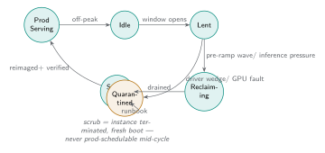

# Operate and maintain the platform

Day-2 how-to for the platform team: the recurring and on-call tasks of keeping
the fleet healthy after it is [deployed](deploy-platform.md). Each section is a
task with a trigger and steps. It assumes the [architecture](../docs/explanation/architecture.md).

Everything that changes desired state goes through a PR to the monorepo — git is
the only write API. The `kubectl` reads below are for observation; the writes
are break-glass, called out where they apply.

## Routine

### Resize the warm floor

**Trigger:** quarterly review, or the game-day fails on latency and the fix is
more never-lent headroom (Assumption 5). **Do:** edit the warm-floor NodePool /
balloon replica count in `clusters/<region>/karpenter/` by PR; size from the
region's *measured* morning-peak demand in the evidence plane, not a copy of
another region. Watch render-start p95 across the next reclaim window.

### Quarterly held-fleet review

**Trigger:** every quarter. **Do:** pull reclaimed-hours-served and
$/GPU-hour from the evidence plane. If reclaimed hours are under-utilized
(training backlog too thin — Assumption 3), the correct response is to *shrink
the held fleet* and the premium, not to push more lending. Adjust ODCR sizing by
PR; carve down via [capacity-carve](capacity-carve.md) semantics
(verify-before-release).

### Rotate spoke credentials

**Trigger:** rotation policy, or suspected hub compromise. **Do:** rotate the
per-spoke assume-role, update the ArgoCD cluster secret, confirm the spoke keeps
reconciling. Never widen a spoke credential to fleet-wide admin to "make it
work" — a scoped credential is the blast-radius control.

### Upgrade a platform component (Karpenter / Kueue / Kyverno / ArgoCD)

**Trigger:** a needed fix or version bump. **Do:** bump the pinned version in the
component's overlay by PR; `make validate` locally first. For Kueue, re-verify
the borrowing-limit reclaim behavior against the game-day harness before rolling
to all regions (the cohort borrowing-order bug, kueue#7016, is version
sensitive). For Karpenter, confirm the reserved-capacity feature stays enabled
or NodePools silently fall back to on-demand.

## On-call

The states a GPU node moves through — the machine the lending controller drives,
and the map for the on-call tasks below:

{ .diagram }

### Preemption storm at morning ramp

**Trigger:** render-start p95 climbing during reclaim. **Do:** the warm floor
plus staged waves should absorb it; if not, the first lever is warm-floor size
(above), not tightening the training grace (that only destroys training work).
If a wave is stalled, check for a spilled inference pod with a PDB blocking the
drain, and for nodes stuck in scrub.

### Wedged GPU node

**Trigger:** DCGM reports a device fault, or a node fails health post-scrub.
**Do:** [quarantine the GPU node](gpu-node-quarantine.md) — quarantine taint,
diagnose, then scrub. Karpenter's auto-repair is alpha and unreliable for GPU
faults (kubernetes-sigs/karpenter#2833); remediation is this runbook, not the
feature.

### Scrub not completing / node won't rejoin prod

**Trigger:** a reclaimed node isn't returning to the prod-tolerable pool. **Do:**
[scrub a node](node-scrub.md) — confirm the instance was *terminated* (new
instance ID), the fresh AMI booted, DCGM is clean, and taints are correct before
untainting to prod. A node must never be prod-schedulable between lend and
completed scrub.

### Hub outage

**Trigger:** ArgoCD/management cluster down. **Do:** spokes keep serving and
lending — their controllers are region-local (KTD7). Reconciliation is paused,
so freeze merges. Rebuild the hub from Terraform + git (it is fully
reproducible); re-register spokes with scoped credentials. Do not hand-apply to
spokes to "bridge the gap" — that breaks the git-only write invariant.

### Emergency: stop lending now

**Trigger:** any reason to halt lending immediately. **Do:** the reclaim path is
region-local, so a PR shrinking the borrowing-limit curve to zero is the clean
stop; for a true emergency, the lending controller's stop path drains lendable
nodes. Never release the reservation — stopping lending returns nodes to
inference, it does not descale.

## Scarcity response

**Trigger:** the evidence plane's asked/got series shows unmet GPU requests
(e.g. "asked 8×G7e, got 3"). **Do:** this is data for the fleet-shaping loop, not
an incident — feed it into the quarterly review and the region-set decision
(`docs/region-set.md`). Scarcity is structured evidence by design; do not paper
over it with emergency on-demand launches that violate the capacity ledger.

## What you never do

- Apply to a cluster by hand outside break-glass — it breaks audit and drift
  detection.
- Weaken a policy to make a workload pass — fix the workload; the policy is the
  boundary the lending model depends on.
- Release or descale held capacity as a side effect of any operation.
- Widen a scoped credential to make something work.
